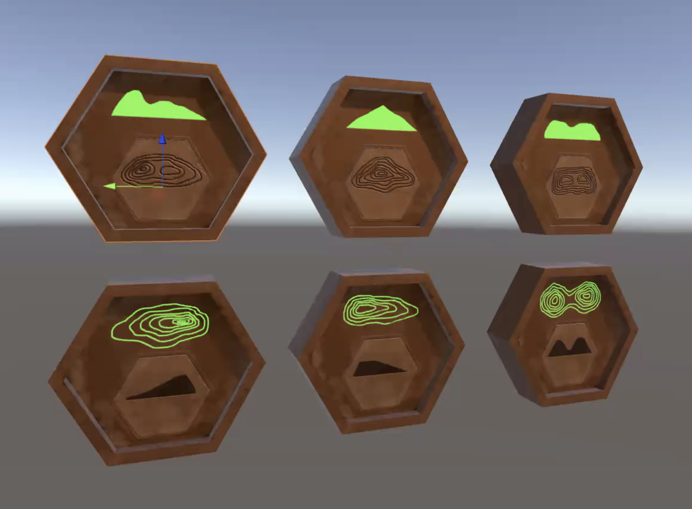
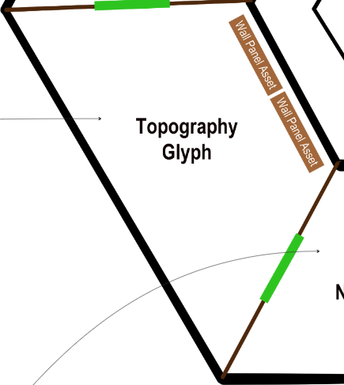

## Topography  Glyph Puzzle Requirements

Description

Player enters rooms with a locked door on the other side. There are 6 hexagonal sockets on the wall and 6 hexagonal panels scattered on the floor. The sockets are individually connected, through the wall and ground, to a center feature in the center of the floor.

Each panel contains a unique image of the side profile of a topographic feature. Each socket has a corresponding topographic map (overhead) image of that same feature.

The object of the puzzle is to match all 6 side profile panels with their corresponding topographic map features. The player picks up a panel and slots it into a socket. They can also remove a panel from one socket to place it into another.

When all six slots are filled the camera moves to a position where all 6 sockets can be viewed. From left to right, the socket/panel combinations are validated. Correct matches light up green and the wall/floor connection emits green. Incorrect matches stay unlit. The incorrect panels are then returned to their original positions.

Depending on the number of incorrect matches (and number of attempts), the player is given feedback from DANI via dialogue.

Play continues until all tiles are in the correct sockets. When this happens the center socket reveals the glyph piece. The player can then interact with the glyph piece and the door at the end of the room unlocks. The player can then exit the room to progress.

Sockets

## Puzzle Sequence

Player enters room

6 unique panels on floor

6 sockets with corresponding diagrams on wall

Feature (contains glyph piece) in the center of the floor

E to interact on panels

Pick up panel (carry)

Place panel in socket (insert)

Remove panel from socket (carry)

All pieces in/sockets are filled 

Camera gives view of the wall with all the sockets/panels

Solution Validation

Pieces, from left to right, are validated in sequence with a configurable delay and sound

Correct pieces

Play “correct” sound

Socket and line to “center feature” emit green

Piece is locked (player cannot interact with the piece or socket)

Wrong pieces do not emit

Play “incorrect” sound

Results

All pieces are correct

Camera to Center feature reveals “glyph piece”

Camera returns to player

Player interacts with glyph piece and takes it (inventory later)

Camera to center feature with door in view - Line between center feature and door turns green

Door Unlocks

Camera returns to player

All pieces are not correct

Incorrect pieces are moved back to their original location

Feedback given ( document here ) Via dialogue prompt

Player attempts puzzle again

## Components

- Panels

<!-- -->

- 6 hexagonal panels

<!-- -->

- 3 side profile of topographic feature

- 6 hexagonal sockets

<!-- -->

- Larger than panels, contains a slot for the panels in addition to a topographic feature (as viewed on a topographic map)
- Placed on the single inner wall

## Developer Notes

- Assets/models are created
- U2 Dungeon is in the project as a prefab

<!-- -->

- Unpack dungeon to use the room and glyphs

<!-- -->

- Prototype build can commence to achieve these goals:

<!-- -->

- create base functionality by:

<!-- -->

- creating an initializing script to activate the game

<!-- -->

- “activate” is being used vaguely here; developer’s discretion to how to achieve this

<!-- -->

- user can pick up and place items in any socket
- validation is called according to documentation and can determine correct/incorrect panels

<!-- -->

- create a separate scene for easy-access testing
- use new and unpacked U2 Dungeon
- camera movements are not necessary for the prototype, but can be implemented if time allows

<!-- -->

- Estimated time to complete prototype: 1-2 sprints (2-4 weeks)

<!-- -->

- Ideally 1 sprint, but there may be an aspect of discovery that takes more time

<!-- -->

- Prototype is NOT expected to include the dialogue system 
