## 1.0 Glyphs (For Reference)

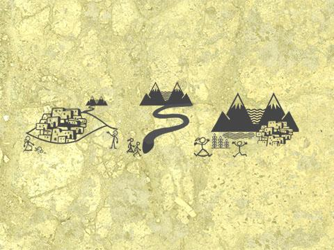

DANI

It seems like this glyph is about watersheds .  A watershed is an area of land that includes all the streams and rivers that flow together and eventually go out to sea. It also seems that larger watersheds will have more water flowing through them... that seems important. Wait.. what is this… what is the moon doing there it seems a bit out of place.

DANI

It looks like this glyph is showing what happens to particles when they dissolve in water. Notice that immediately after the particle is added to the water it is still visible. Soon after you can no longer see the particles, but they are still in the water they are just dissolved.

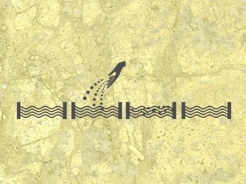

Unit 1

Unit 2

## Unit 2: Topographic Map Glyph

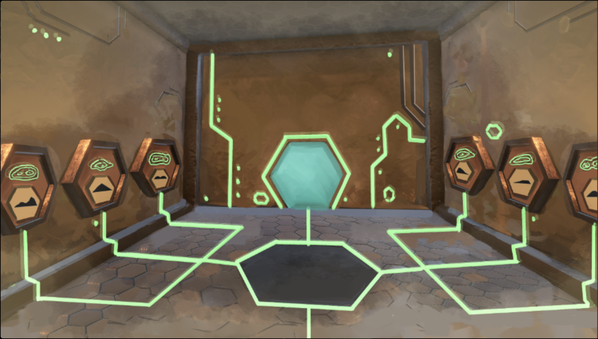

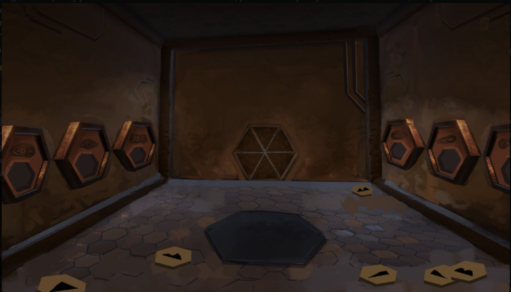

After completion (correctly matching each piece to its respective slot) a hexagonal glyph piece appears in the center. Players collect this image as a  puzzle piece  that is used to put together a giant glyph image (map of planet or some alien curricular summary diagram) in Unit 6? 

?

( Can pick up and hold only 1 ground piece at a time.)

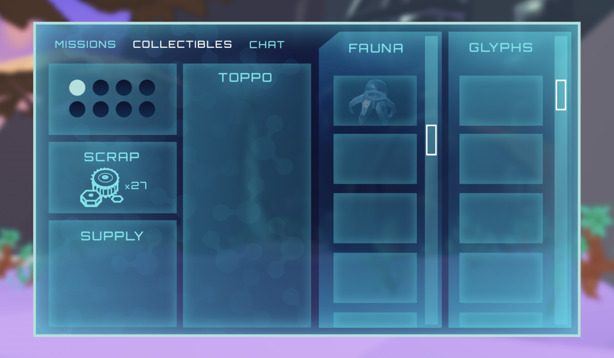

## Unit 2: Topographic Map Glyph

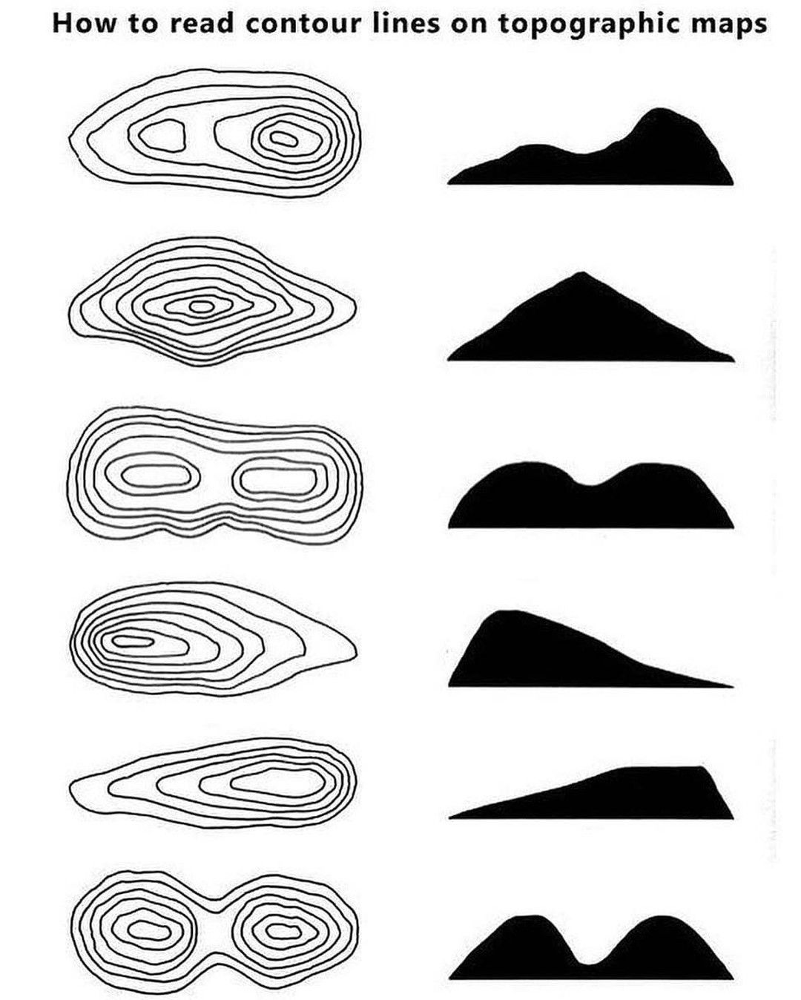

Correct Answers

Wall

Ground

## Slide 4

Sequencing and Mechanics

Player enters room

Pieces are always in the same location

Pick up/Place

E to pick up, one a time

Place - Snap to location when close (I’m not sure of the layout of the physical so if pressing E works better that’s fine too) 

P layer can remove piece from the socket if they aren’t carrying one

All pieces in - Validation  (Page 11 in Unit 2 Combo doc)

Camera  provide  a view of all pieces

Validation and Ejection  happen  simultaneously

Feedback given (Page 11 in Unit 2 Combo doc)

Feedback delivered through dialogue or can through an onscreen message that doesn’t take control away from the player

Wrong piece rejection occurs after feedback is given

Outcome

Correct

Piece revealed in center

Player grabs center piece,  piece stored in DANI menu,  door opens

Not Complete

Incorrect  pieces “dropped”

Physics or animation?

Pieces reset to original location

Back to 2.

## Unit 2: Watershed Size/Flow Glyph

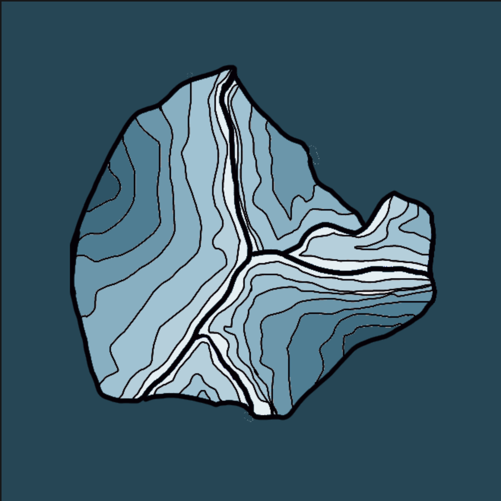

Unassembled Glyph

Players walk in to see a 3d model of a landmass similar to the map image below on a pedestal in the center of the room. There is “water” falling from the ceiling onto the model (this is just for visual/demonstrative purposes and cannot be manipulated by the player).  There are additional pieces of “landmass” on the floor scattered about the room that the player can pick up and move.

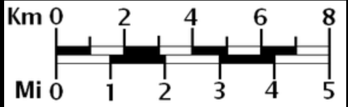

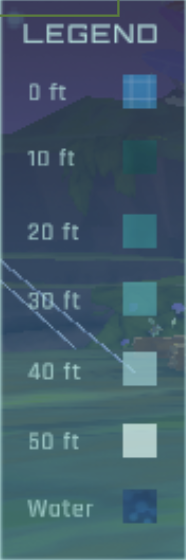

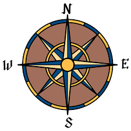

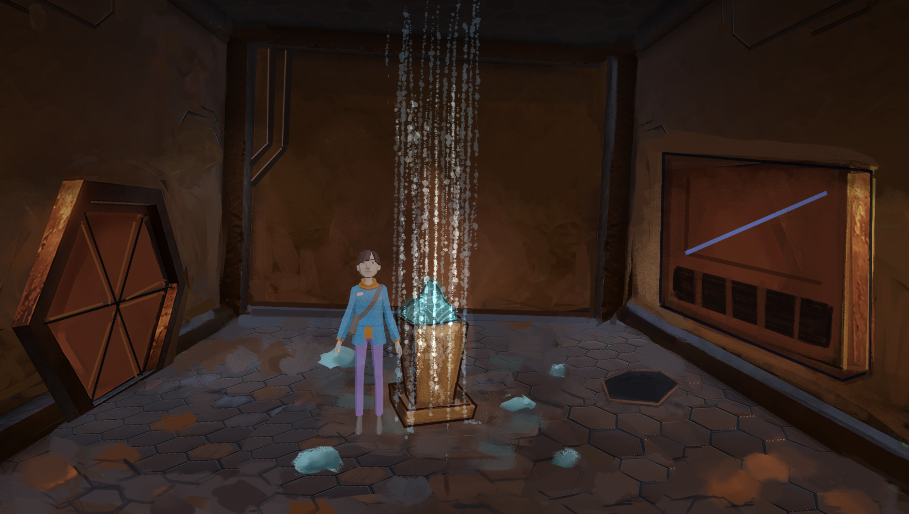

## Unit 2: Watershed Size/Flow Glyph

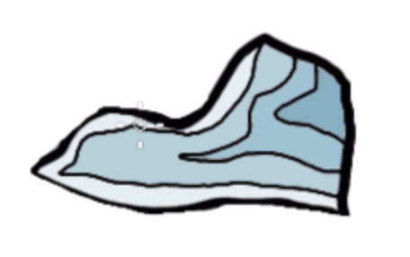

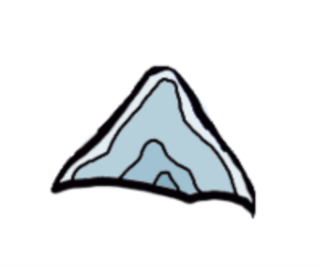

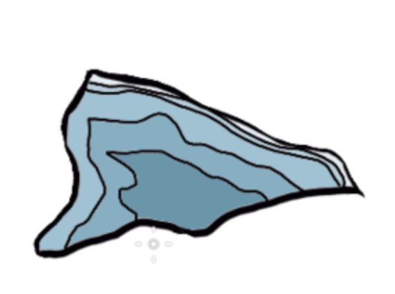

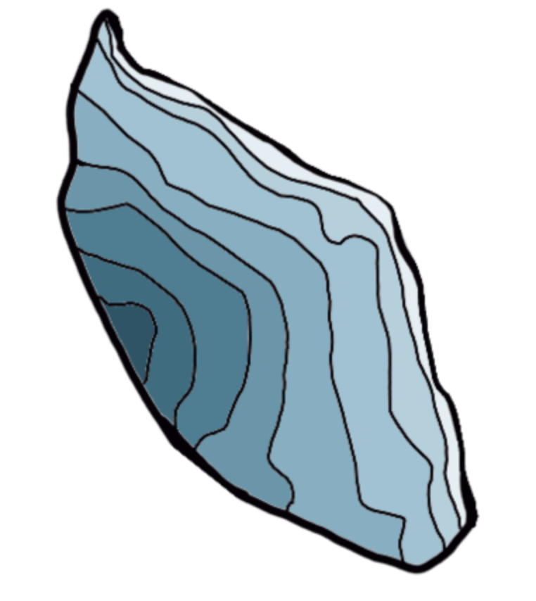

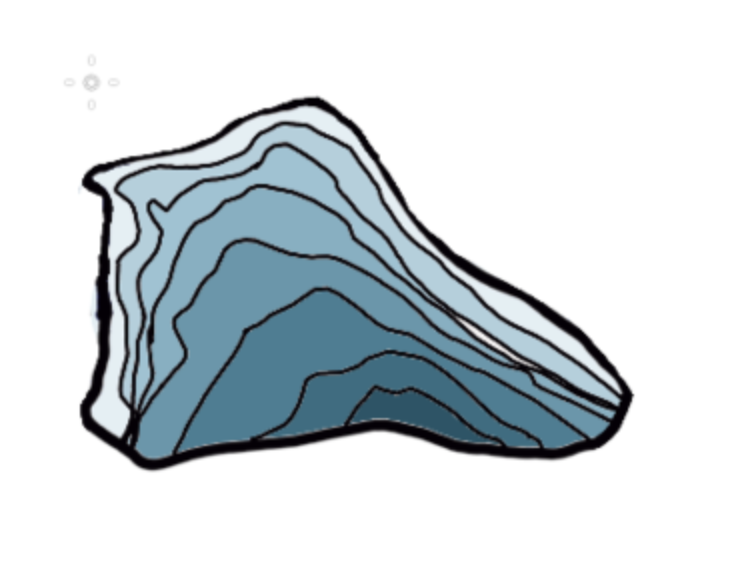

A ssembled Glyph

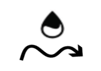

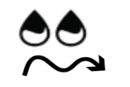

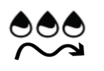

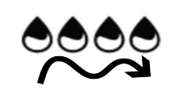

## Slide 7

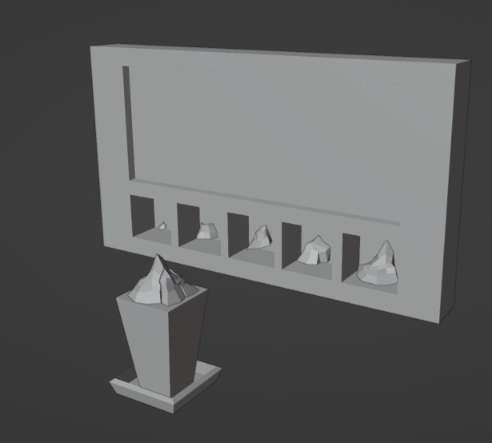

## Slide 8

Sequencing and Mechanics   (Basically the Same as U2 Glyph #1)

Player enters room

Pieces are always in the same location

Pick up/Place

E to pick up, one a time

Place - Snap to location when close (I’m not sure of the layout of the physical so if pressing E works better that’s fine too) 

Player can remove piece from the socket if they aren’t carrying one

All pieces in - Validation  (Page 36 in Unit 2 Combo doc)

Camera provide a view of all pieces

Validation and Ejection happen simultaneously

Feedback given (Page 36 in Unit 2 Combo doc)

Feedback delivered through dialogue or can through an onscreen message that doesn’t take control away from the player

Wrong piece rejection occurs after feedback is given

Outcome

Correct

Piece revealed in center

Player grabs center piece, piece stored in DANI menu, door opens

Not Complete

Incorrect pieces “dropped”

Physics or animation?

Pieces reset to original location

Back to 2.

## Watershed Glyph Developer Notes Extremely similar to  Topography Glyph Game Assets/Models are created U2 dungeon is in the project as a prefab Unpack dungeon and use the room and glyph models for prototype Prototype can commence to achieve these goals: create base functionality by: having an initializing script to begin the game Up to developer’s discretion how much is needed to be initialized At the bare minimum this script must start the game Player can pick up and place glyphs validation is called  successfully  and placeholder outputs are put in place these placeholder outputs will eventually be output through the dialogue  system Achieve basic completion of the Sequencing and Mechanics slide Use placeholders for the dialogue system in the prototype create a separate scene for easy testing use new and unpacked U2 Dungeon camera movements are not necessary for the prototype, can be included if time permissible Estimated time to complete the prototype: 1-2 sprints (2-4 weeks) Ideally one sprint, but there may be an aspect of discovery that takes more time Prototype is NOT expected to incorporate the dialogue system - use placeholders as much as possible instead
