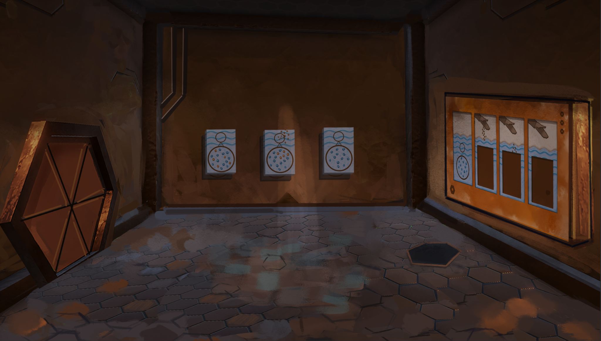
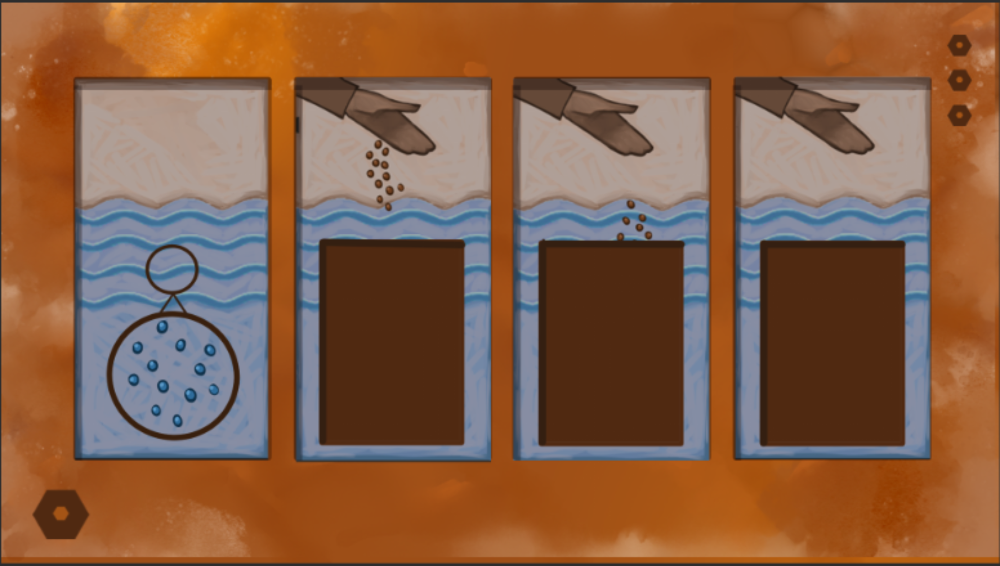
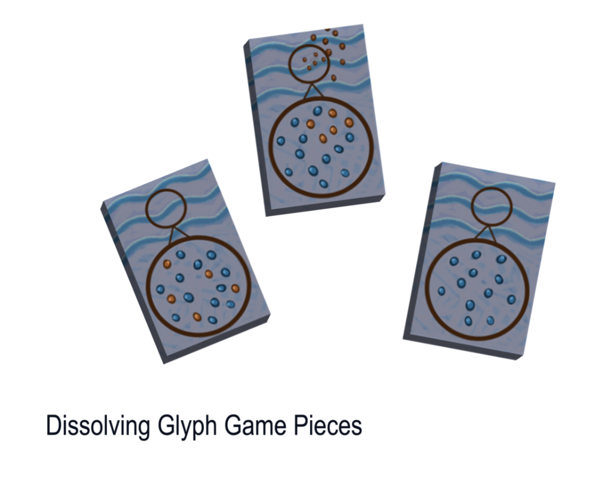
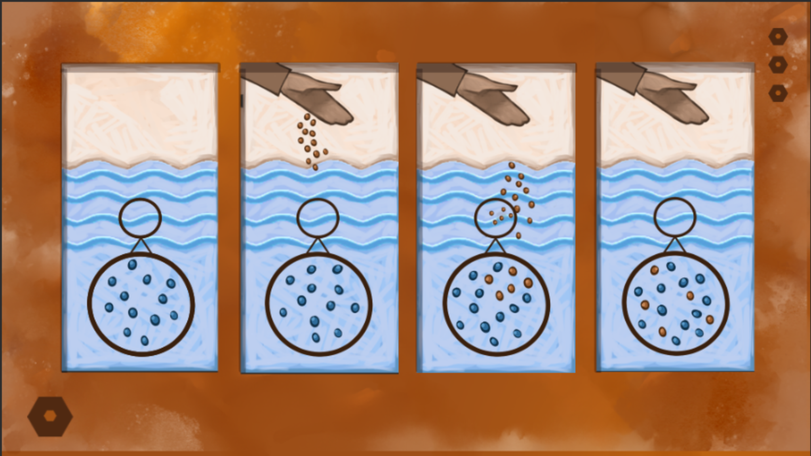

## Slide 1

U3 Dissolving Glyph

Design Documentation

Quest Objective

Place panels in correct locations to visually represent a dissolving pollutant

Core Concept 

Understand that while dissolved pollutants may not be seen they are still present

Performance Determining Factors

Correct- all panels in correct location

Incorrect- any panel in an incorrect location

## Slide 2

Sequencing and Mechanics     (Basically the same  functionality  as U2 Glyphs)

Player enters room ( Combo Doc Link )

Pieces are always in the same location  (can be on scattered on floor, leaning up against wall, hanging on wall as shown below- whatever works best)

Note: there will only be three pieces in this puzzle as piece #1 should already be in place

Pick up/Place

Player use E to pick up a panel, only one a time

Player uses E to deposit panel in glyph slot 

Player can remove pieces from slot with E

After all slots filled validation occurs (see here for answers)

Camera provides a view of all panels

Validation for correct/incorrect happens simultaneously 

Green glow around correct panel

No color change or glow if panel is incorrect

Incorrect panels ejected from slots 

Feedback given by DANI ( found here  or  next slides ) 

Outcome

If all Correct

Collectible piece revealed in center of room

Player grabs center piece, piece stored in DANI menu, door opens

If any Incorrect

Player returns to step 2

## Components

Unassembled  Glyph

Assets are located in project under Art_NewAssets / U3 - Dissolve Glyph folder

Art Assets

- Glyph pieces
- Glyph wall 
- UI pop-up for using “E/Action” to pick up, 

place and drop pieces

- Collectible piece in center of room

## Components

Correctly Assembled Glyph

## Feedback

| GLYPH FEEDBACK: DISSOLVED PARTICLES |  |  |  |  |  |  |  |  |
|----|----|----|----|----|----|----|----|----|
| NO PLAYER INTERACTION |  |  |  |  |  |  |  |  |
| {If player doesn’t interact with objects around the room in 30 seconds…} DANI  \[gameplay\] The stone tablets on the ground appear as if they can be moved. |  | {If player doesn’t interact with objects around the room in 60 seconds…} DANI  \[gameplay\] I calculate a high probability that the tablets on the ground correspond to the images on the right side of the wall. |  |  | {If player doesn’t interact with objects around the room in 90 seconds…} DANI  \[gameplay\] TK, I recommend moving one of the tablets on the ground to the wall below one of the images. |  |  |  |
| AFTER ALL 4 PANELS CONTAIN A PIECE (“check” automatically happens one piece at a time) |  |  |  |  |  |  |  |  |
| {If a piece is in the correct panel…}  {Animation: panel lights up} {Audio: positive sound plays} |  |  | {If a piece is in the incorrect panel…}  {Audio: negative sound plays} |  |  |  |  |  |

## Slide 6

| FIRST ATTEMPT |  |  |  |  |  |  |  |  |
|----|----|----|----|----|----|----|----|----|
| {If player got 1-2 pieces incorrect on the first try…} DANI  \[gameplay\] This appears to be close to the solution, TK. Please continue trying. |  |  | {If player got 3 pieces incorrect on the first try…} DANI  \[gameplay\] I believe the pieces are intended to be ordered in a specific way. Keep trying. |  |  |  |  |  |
| SECOND ATTEMPT |  |  |  |  |  |  |  |  |
| {If player got 1-3 pieces incorrect on the second try…} DANI  \[curricular\] The circular images appear to represent a closer view of the water and particles in it. I believe this is how the water might appear under a microscope. |  |  |  |  |  |  |  |  |

## Slide 7

| THIRD ATTEMPT |  |  |  |  |  |  |  |  |
|----|----|----|----|----|----|----|----|----|
| {If player got 1-2 pieces incorrect on the third try…} DANI  \[gameplay\] I believe that was close to the correct order, TK. Keep trying.  |  |  | {If player got 3 pieces incorrect on the third try…} DANI  \[curricular\] The images on the right appear to depict particles being added to something, perhaps water. |  |  |  |  |  |
| FOURTH ATTEMPT |  |  |  |  |  |  |  |  |
| {If player got 1-2 pieces incorrect on the fourth try…} DANI  \[gameplay\] That is very close, TK. I believe you can solve it.  |  |  | {If player got 3 pieces incorrect on the fourth try…} DANI  \[gameplay\] Would you like me to assist, TK? PLAYER  \[choices\] |  |  |  |  |  |

| Sure. I’m stuck.      DANI  \[gameplay\] I believe I have calculated the correct order for the puzzle. Activating holid projector.  {Pop-up:  U3 Toppo Lesssons } {Animation: pieces fly to correct locations} | No, I’m okay.  |
|----|----|

## Slide 8

| FIFTH ATTEMPT |  |  |  |  |  |  |  |  |
|----|----|----|----|----|----|----|----|----|
| {If player got 1-3 pieces incorrect on the fifth try…} DANI  \[gameplay\] I believe I have calculated the correct order for the puzzle. Allow me to assist, TK. Activating holid projector.  {Animation: pieces fly to correct locations} |  |  |  |  |  |  |  |  |

After the player solves the glyph: 

{Animation: Collectible middle floor piece is highlighted/ becomes available for pick up}

{Audio: Sound plays to indicate its presence}

DANI  \[curricular\]

It appears the glyph you just solved represents what happens to particles when they dissolve in water. Notice that immediately after the particles are added to the water they are still visible. Soon after, you can no longer see them because they have mixed with the water molecules and spread out. The particles are still present–they are simply too small to be seen because they have dissolved.
