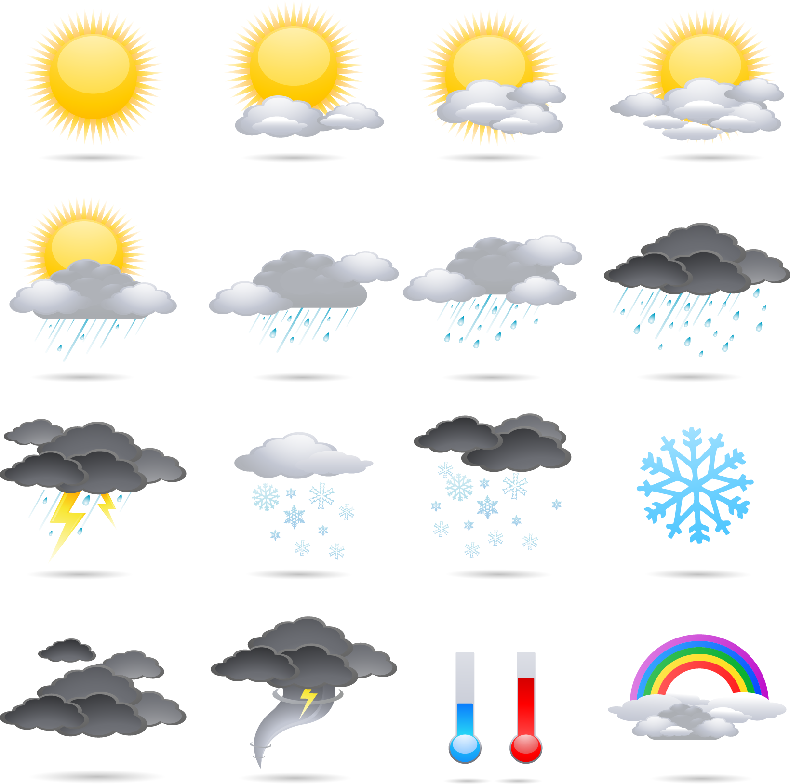

## Slide 1

U5 Evaporation Glyph

Design Documentation

Quest Objective

Place tablets in correct locations to visually represent the evaporation rate that would occur at different temperatures.

Core Concept 

Understand the way temperature affects evaporation rate.

Performance Determining Factors

Correct- all tablets in correct location

Incorrect- any tablets in an incorrect location

## Correct Solution

On floor (or leaning against wall) in random order (can be same for all players)

On wall in this order

## Slide 3

Sequencing and Mechanics     (Basically the same functionality as U2 -U4  Glyphs)

Player enters room 

Movable tone tablets  are always in the same location  (can be on scattered on floor, leaning up against wall, hanging on wall as shown below- whatever works best)

Pick up/Place

Player use E to pick up a  tablet , only one a time

Player uses E to deposit  tablet  in glyph slot 

Player can remove pieces from slot with E

After all slots filled validation occurs (see here for answers)

Camera provides a view of all panels

Validation for correct/incorrect happens simultaneously 

Green glow around correct panel

No color change or glow if panel is incorrect

Incorrect panels ejected from slots 

Feedback given by DANI  (see next slides)

Outcome

If all Correct

Collectible piece revealed in center of room

Player grabs center piece, piece stored in DANI menu, door opens

If any Incorrect

Player returns to step 2

## Feedback

| GLYPH FEEDBACK: Evaporation Rate |  |  |  |  |  |  |  |  |
|----|----|----|----|----|----|----|----|----|
| NO PLAYER INTERACTION |  |  |  |  |  |  |  |  |
| {If player doesn’t interact with objects around the room in 30 seconds…} DANI  \[gameplay\] I believe those stone tablets against the wall may fit into the wall panels. |  | {If player doesn’t interact with objects around the room in 60 seconds…} DANI  \[gameplay\] I calculate a high probability that the stone tablets correspond to the images on the wall. |  |  | {If player doesn’t interact with objects around the room in 90 seconds…} DANI  \[gameplay\] TK, I recommend moving one of the tablets to the wall below one of the images. |  |  |  |
| AFTER ALL 4 PANELS CONTAIN A PIECE (“check” automatically happens one piece at a time) |  |  |  |  |  |  |  |  |
| {If a piece is in the correct panel…}  {Animation: panel lights up} {Audio: positive sound plays} |  |  | {If a piece is in the incorrect panel…}  {Audio: negative sound plays} |  |  |  |  |  |

## Slide 5

| FIRST ATTEMPT |  |  |  |  |  |  |  |  |
|----|----|----|----|----|----|----|----|----|
| {If player got 1-2 pieces incorrect on the first try…} DANI  \[gameplay\] This appears to be close to the solution, TK. Please continue trying. |  |  | {If player got 3-4 pieces incorrect on the first try…} DANI  \[gameplay\] I believe the pieces are intended to be ordered in a specific way. Keep trying. |  |  |  |  |  |
| SECOND ATTEMPT |  |  |  |  |  |  |  |  |
| {If player got 1-4 pieces incorrect on the second try…} DANI  \[curricular\] The tablets you can move appear to have something to do with evaporation rate.  |  |  |  |  |  |  |  |  |

| THIRD ATTEMPT |  |  |  |  |  |  |  |  |
|----|----|----|----|----|----|----|----|----|
| {If player got 1-2 pieces incorrect on the third try…} DANI  \[gameplay\] I believe that was close to the correct order, TK. Keep trying.  |  |  | {If player got 3-4 pieces incorrect on the third try…} DANI  \[curricular\] The images on the wall appear to depict temperatures at different times of day. Try matching them with the evaporation rate you might expect to see in those conditions. |  |  |  |  |  |

## Slide 6

| Sure. I’m stuck.      DANI  \[gameplay\] I believe I have calculated the correct order for the puzzle. Activating holid projector.  {Pop-up: U5 Toppo Lessons } {Animation: pieces fly to correct locations} | No, I’m okay.  |
|----|----|

| FOURTH ATTEMPT |  |  |  |  |  |  |  |  |
|----|----|----|----|----|----|----|----|----|
| {If player got 1-2 pieces incorrect on the fourth try…} DANI  \[gameplay\] That is very close, TK. I believe you can solve it.  |  |  | {If player got 3-4 pieces incorrect on the fourth try…} DANI  \[gameplay\] Would you like me to assist, TK? PLAYER  \[choices\] |  |  |  |  |  |

## Slide 7

| FIFTH ATTEMPT |  |  |  |  |  |  |  |  |
|----|----|----|----|----|----|----|----|----|
| {If player got 1-4 pieces incorrect on the fifth try…} DANI  \[gameplay\] I believe I have calculated the correct order for the puzzle. Allow me to assist, TK. Activating holid projector.  {Animation: pieces fly to correct locations} |  |  |  |  |  |  |  |  |

## Components

Art Assets

- Movable g lyph pieces
- Glyph wall images
- UI pop-up for using “E/Action” to pick up, 

place and drop pieces

- Collectible piece in center of room

Assets are located in project under… 
