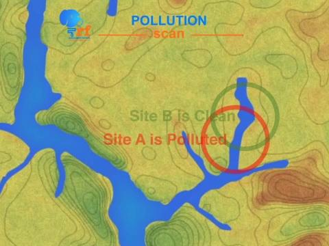

## U3 DANI Charts 

MHS 2.0

Unit 2 DANI Charts are now  here.  

## Unit 3: Pollution Scan Results (DANI Chart)

DANI

I have overlayed the collected sensor data on the map. By observing the clean versus polluted areas of the river, you have determined the source of the pollution. This information should help convince Tera we know exactly where the source is located–I’ll patch you through to her.

Same visual but a still image
