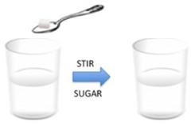

## Argumentation Introduction

## Slide 2

Tera and Aryn  pour  sugar  grains into a glass of hot water. They make three observations.

Once the sugar is poured into the water, it is stirred. After stirring, the sugar can no longer be seen.

Also after stirring, each student tastes the water. They both agree     that the water tastes sweet.

The weight of the water + glass + sugar is the same as the weight of the glass containing the mixture after the sugar was stirred in.

## Slide 3

Tera and Aryn  discuss what they think happened to the sugar.

- Tera  says I think the sugar is gone because I can no longer see sugar in the glass. If the sugar is not visible then it must have disappeared. 
- Aryn  says: The sugar is still there. The total mass was equal to the sugar and the water if measured separately. If the sugar disappeared, the mass would have changed.

What is  Tera ’s  claim ?

What is  Aryn ’s  claim ? 

## Slide 4

Tera and Aryn  discuss what they think happened to the sugar.

- Tera  says I think the sugar is gone because I can no longer see sugar in the glass. If the sugar is not visible then it must have disappeared. 
- Aryn  says: The sugar is still there. The total mass was equal to the sugar and the water if measured separately. If the sugar disappeared, the mass would have changed.

What is  Tera ’s  evidence ?

What is  Aryn ’s  evidence ? 

## Slide 5

Tera and Aryn  discuss what they think happened to the sugar.

- Tera  says I think the sugar is gone because I can no longer see sugar in the glass. If the sugar is not visible then it must have disappeared. 
- Aryn  says: The sugar is still there. The total mass was equal to the sugar and the water if measured separately. If the sugar disappeared, the mass would have changed.

What is  Tera ’s  reasoning ?

What is  Aryn ’s  reasoning ? 

## Slide 6

In the first unit of MHS, you are asked to create an argument to determine if the planet WAT 247 has freshwater. 

Your team has collected the following information about WAT 247:

The oceans on WAT 247 are three times saltier than Earth

Plants that require freshwater grow on the landmasses of WAT 247

## Slide 7

Tera and Aryn  discuss  if they think WAT 247 has freshwater

- Tera  says I think  WAT 247 has freshwater. Plants that require  freshwater  grow on the landmasses of WAT 247. Since plants that require freshwater can grow on WAT 247,there must be freshwater  for  humans to drink.
- Aryn  says:  I think WAT 247 does not have freshwater. The oceans on WAT 247 are three times saltier than Earth. Since the  oceans are saltier than Earth, the water is too salty to drink.

What is  Tera ’s  claim ?

What is  Aryn ’s  claim ? 

## Slide 8

Tera and Aryn  discuss  if they think WAT 247 has freshwater

- Tera  says I think  WAT 247 has freshwater. Plants that require freshwater grow on the landmasses of WAT 247. Since plants that require freshwater can grow on WAT 247,there must be freshwater for humans to drink.
- Aryn  says:  I think WAT 247 does not have freshwater. The oceans on WAT 247 are three times saltier than Earth. Since the oceans are saltier than Earth, the water is too salty to drink.

What is  Tera ’s  evidence ?

What is  Aryn ’s  evidence ? 

## Slide 9

Tera and Aryn  discuss  if they think WAT 247 has freshwater

- Tera  says I think  WAT 247 has freshwater. Plants that require freshwater grow on the landmasses of WAT 247. Since plants that require freshwater can grow on WAT 247,there must be freshwater for humans to drink.
- Aryn  says:  I think WAT 247 does not have freshwater. The oceans on WAT 247 are three times saltier than Earth. Since the oceans are saltier than Earth, the water is too salty to drink.

What is  Tera ’s  reasoning ?

What is  Aryn ’s  reasoning ? 
