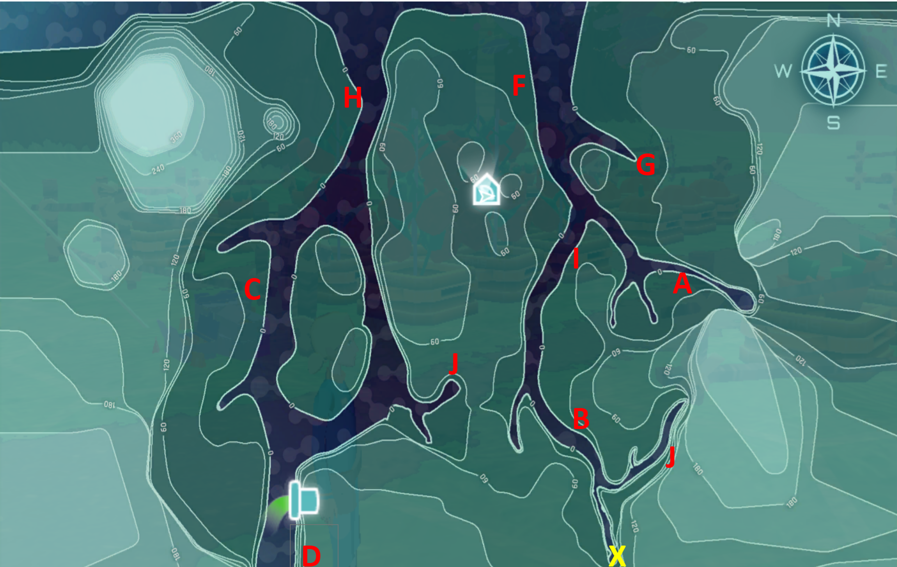

## Argumentation Review

## Slide 2

## Slide 3

Two students created arguments about which  locations  would be most affected by the oil spill  at the     pipe .

John  says:  Site D  would be the affected by the oil spill. Since  Site D  and  oil spill pipe  are so close to each other the oil spill will impact  Site D  more than the other  locations  that are much farther away.

Matt  says: I think  Site H  will be affected by the oil spill. Since  Site H  is located downstream of the  oil pipe , the polluted water will travel downstream and pollute the waters  at Site H

What is John’s  claim ?

What is Matt’s  claim ?

## Slide 4

Two students created arguments about which locations would be most affected by the oil spill at the      pipe.

John  says:  Site D would be the affected by the oil spill. Since Site D and oil spill pipe are so close to each other the oil spill will impact Site D more than the other locations that are much farther away.

Matt  says:  I think Site H will be affected by the oil spill. Since Site H is located downstream of the oil pipe, the polluted water will travel downstream and pollute the waters at Site H.

What is John’s  evidence ?

What is Matt’s  evidence ?

## Slide 5

Two students created arguments about which locations would be most affected by the oil spill at the     pipe.

John  says:  Site D would be the affected by the oil spill. Since Site D and oil spill pipe are so close to each other the oil spill will impact Site D more than the other locations that are much farther away.

Matt  says:  I think Site H will be affected by the oil spill. Since Site H is located downstream of the oil pipe, the polluted water will travel downstream and pollute the waters at Site H.

What is John’s  reasoning ?

What is Matt’s  reasoning ?

## Slide 6

Two students created arguments about which locations would be most affected by the oil spill at the     pipe.

John  says:  Site D would be the affected by the oil spill. Since Site D and oil spill pipe are so close to each other the oil spill will impact Site D more than the other locations that are much farther away.

Matt  says:  I think Site H will be affected by the oil spill. Since Site H is located downstream of the oil pipe, the polluted water will travel downstream and pollute the waters at Site H.

Based on the two arguments above, which student do you agree with? Why? 

## Slide 7

Two students created arguments about which locations would be most affected by the oil spill at the      pipe.

Mindy  says: Site J will not be affected by the oil spill. Based on the map, Site J is located on a different branch of the the river and therefore is not downstream of the oil pipe. Since rivers flow downstream, the polluted water will not reach Site J. 

Sarah  says: Site J won’t be affected by the oil spill. Since rivers flow downstream, the polluted water will not pass through Site J. 

Whose argument do you think is better? Why?

