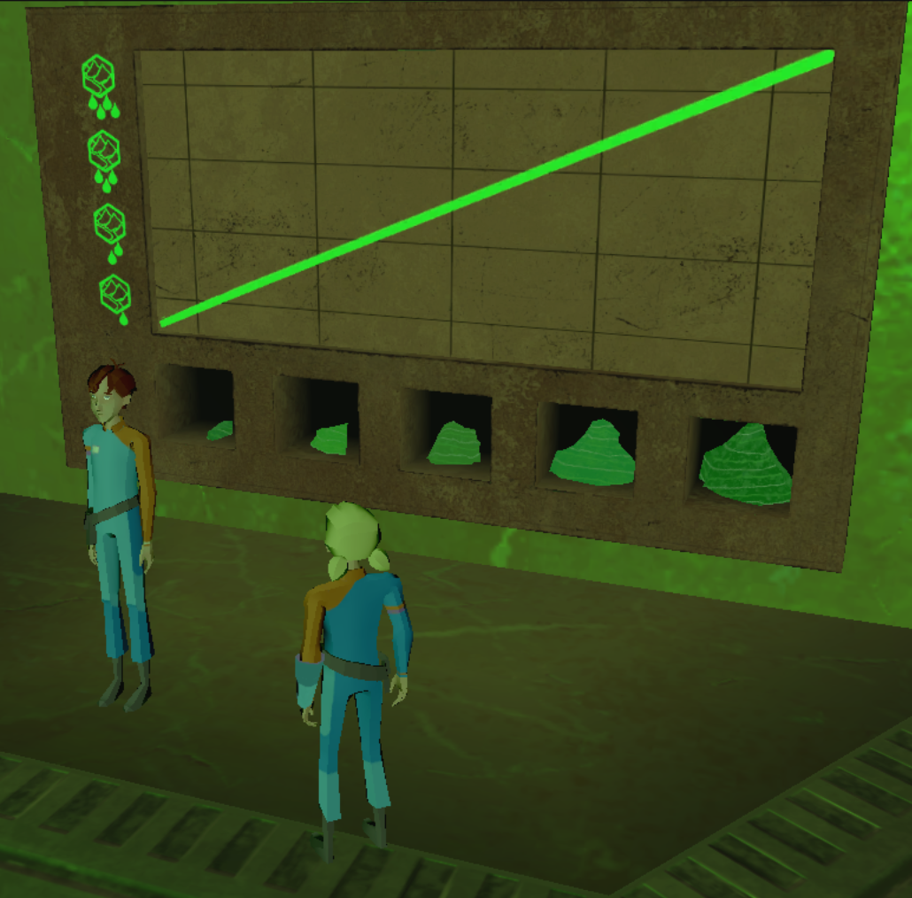
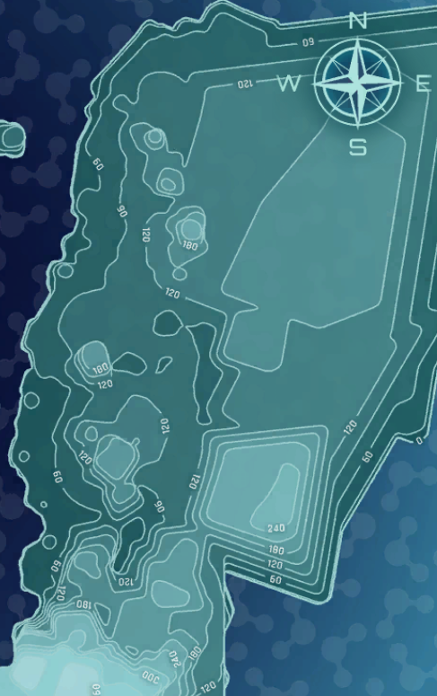

## U2 Follow-up

## Slide 2

The table below shows evidence that was collected in Unit 2 of MHS.  Based on your previous experience in the game, what do we know about the two watersheds connected to the two waterfalls?

What does that tell you about the area of the two watersheds?

|  | Collected from? | East River | West River |
|----|----|----|----|
| Waterfall flow from each system  | Player at waterfall | 30 L per second | 100 L per second |
| Height of waterfall  | Player at waterfall | 35m  | 20m  |
| Water Salinity  | Player at waterfall |  .002 PPT | .0035 PPT  |
| Number of lakes  | Tera | 1 | 0 |
| Length from waterfall to ocean  | Aryn | 85 Km  | 450 Km  |

## Slide 3

The image on the right  depicts a glyph puzzle from MHS. 

What do you think the pieces along the bottom (x axis) of the graph represent?

What do you think the icons on the left (y axis) represent?

Based on the plotted green line, explain the relationship shown in this graph.

## Slide 4

Which location on the topographic map would you expect to be at the highest elevation? How do you know?

A. Point A

B. Point B

C. Point C

D. Point D

Which location on the topographic map would you expect to be at the lowest elevation? How do you know?

A. Point A

B. Point B

C. Point C

D. Point D

C

A

B

D
