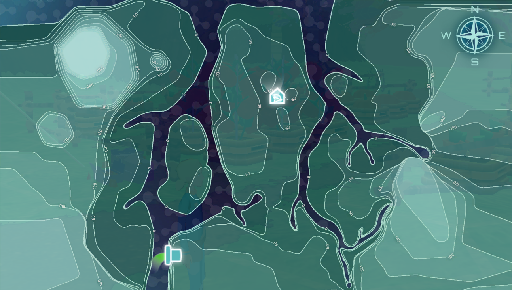

## U3 Follow-up

## Slide 2

The image on the right is the map you explored during Unit 3 of MHS.

Between  points A and B,  which direction is the water moving?

A

B

## Slide 3

Suppose the pipe near the southern edge of the map, represents an oil spill. Which points  would  be impacted by the oil spill and why?

Point A

Point B

Point C

Point D

A

B

C

D

## Slide 4

If you boarded a boat at location X, which Points  would  you see as you travel downstream? What order  would  you see the points in?

A

B

I

J

X

F

G

H

J

C

D
