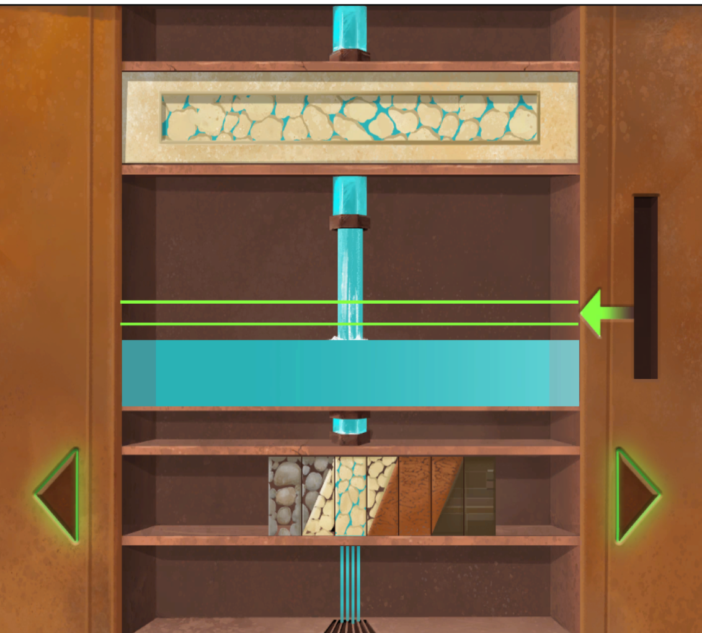
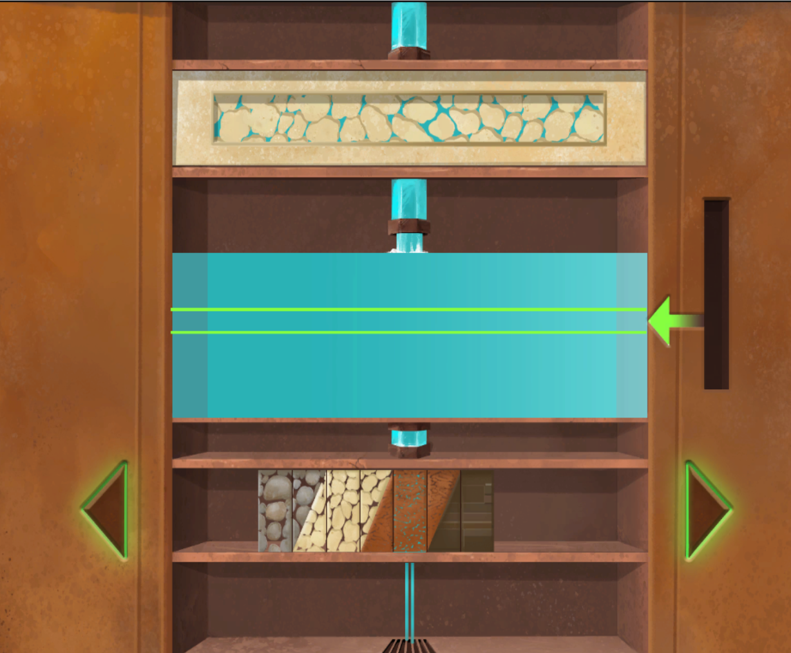
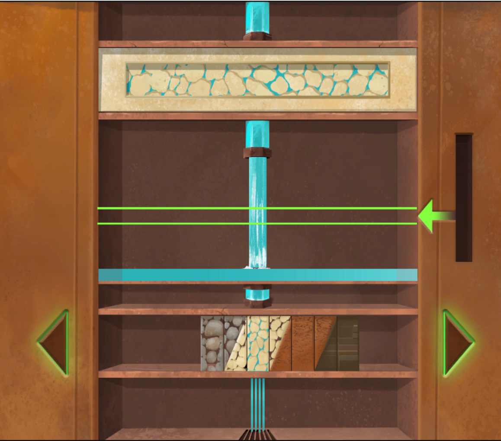
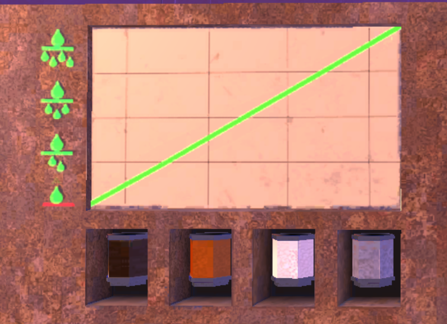
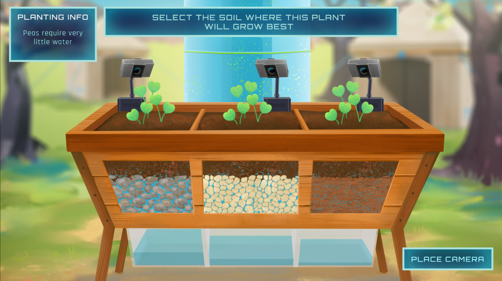
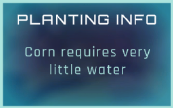
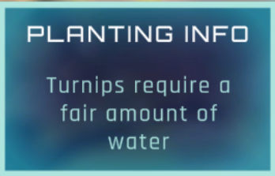
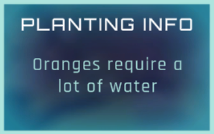

## U4 Follow-up

## Slide 2

The picture on the right is from the soil key puzzle in MHS. The goal of the puzzle is to change the water level in the lock, and for it to remain within the green bars. The controls at the bottom changes the type of soil that the water passes through. There is a constant amount of water entering the lock at the top, and by adjusting the soil bar at the bottom the water level will change. 

## Slide 3

In the picture to the left there is more clay than sand in soil key. How will that affect water moving through the key?

In the picture to the right there is more sand than clay in soil key. How will that affect water moving through the key?

How would you lower the water level in the soil puzzles?

How would you raise the water level in the soil puzzles?

How is it possible to keep the water level constant in the soil puzzles?

## Slide 4

Suppose you wanted to change the water level to point A. How would you do this?

Suppose you wanted to change the level to point B. How would you do this?

How would you keep the water level in between the two  green  lines?

A

B

## Slide 5

The graph to the right is shown in the dungeon of Unit 4 in MHS. 

What do you think the icons Left Vertical (Y) axis represent? 

Why do you think the bottom icon has a red line and the others have a green line?

Describe the  relationship  shown in this graph.

 

## Slide 6

In  the garden box below, you planted a crop that needs very little water. In which box, would this plant grow best?

 

A

B

C

## Slide 7

In the final task of Unit 4, you were asked to help place a camera to capture the crop growing the best in each garden plot.  In  the garden box below, you planted a crop that needs very little water. In which box, would this plant grow best?

 

A

B

C

## Slide 8

In  the garden box below, you planted a crop that needs very little water. In which box, would this plant grow best?

 

A

B

C
