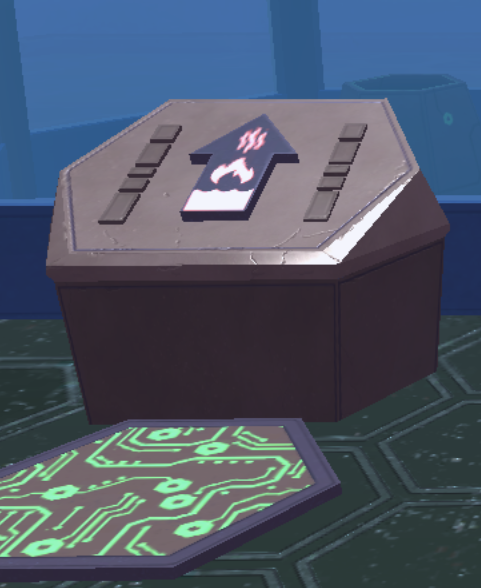
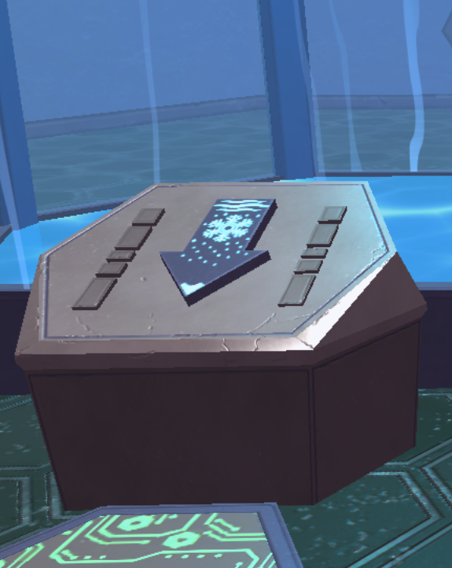
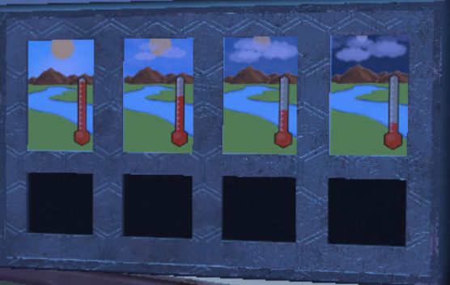
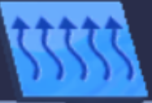
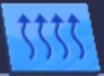
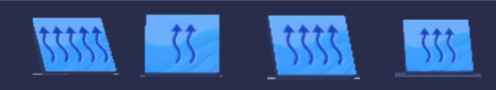
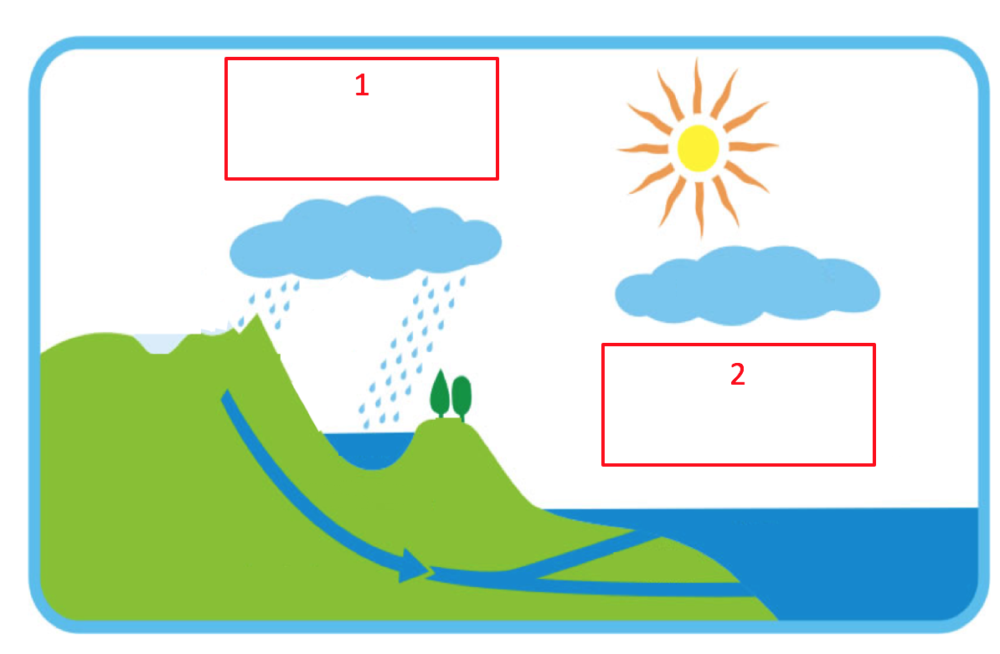

## U5 Follow-up

## Slide 2

These pictures are found within the puzzle dungeons you may have seen in Unit 5 of MHS. They are designed to show a very specific water process.

## Slide 3

Describe the process that is being represented in the picture on the right in the puzzle dungeon. 

What do you think the arrow represents?

## Slide 4

Describe the process that is being represented in the picture on the right in the puzzle dungeon. 

What do you think the arrow represents?

## Slide 5

In Unit 5 of MHS you encounter the images below in the puzzle dungeon. 

You are tasked with  matching  the following pieces:

## Slide 6

Match the pieces A, B, C, D to the  appropriate  spaces 1,2,3,4

1

2

3

4

A

B

C

D

## Slide 7

Match both pictures A and B to the correct box in the diagram of the water cycle below. 

How did you know where to place the pictures? 

A

B

