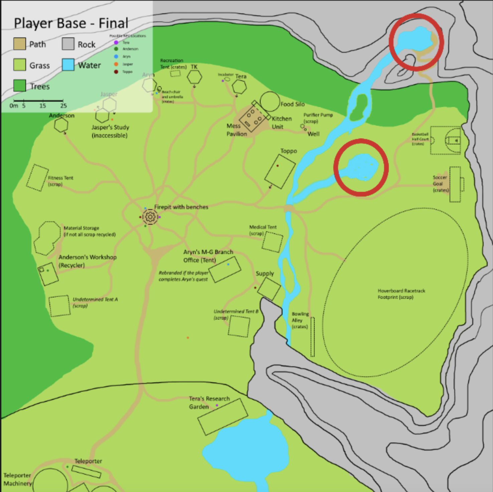
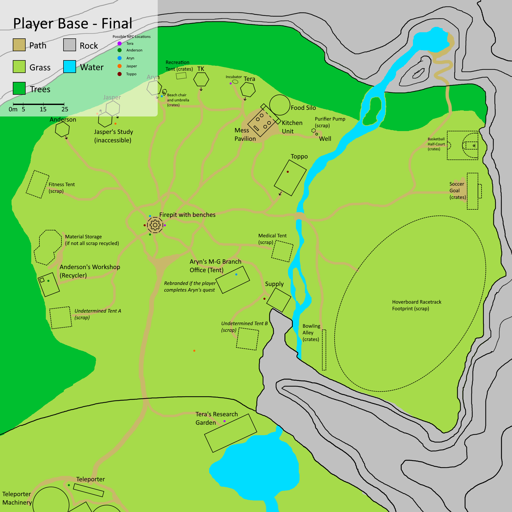
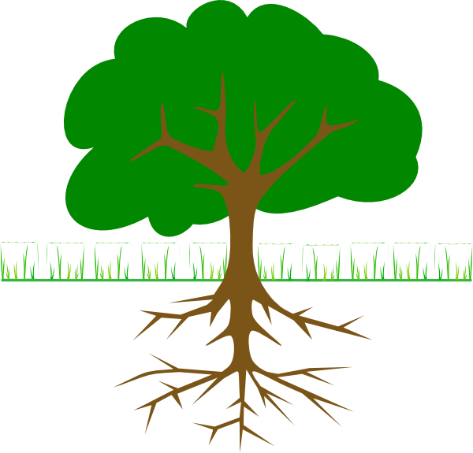

## Base Camp Tasks

## NGSS Standards :

Argumentation/Engineering Design: 

 6-8.ETS1.A Define the criteria and constraints of a design problem with sufficient precision to ensure a successful solution, taking into account relevant scientific principles and potential impacts on people and the natural environment that may limit possible solutions. 

Human Impacts on the Environment:

6-8.ESS3.C.1 Analyze data to define the relationship for how increases in human population and per-capita consumption of natural resources impact Earth's systems.

6-8.ESS3.C.2 Apply scientific principles to design a method for monitoring and minimizing a human impact on the environment. 

## Slide 3

## Unit 3 Scenario 

Tera asks for the player's help in converting a pond at base into a fish hatchery. 

Player is given two options of where to set up the hatchery because Tera isn’t sure where to put the hatchery to protect the plants from a component of the fish waste. 

If player chooses pond A, p lants downstream wilt/ die due to the pollutants.

If player chooses pond B, the plants will survive.

\*Involves adding a pond but is curricularly tied to U3 and HI objectives

Location of Plants

## Unit 4 Scenario 

Anderson asks the player to choose the location of the base camp well by examining the underlying soil structure. 

They are given two possible locations, and soil scans of those locations. 

\#1

\#2

## Slide 6

Bedrock

Clay

Sand

Gravel

Sand

Well

Bedrock

Clay

Sand

Gravel

Sand

Well

Option #2:

- Closest to kitchen area
- Animal tunnels  visible nearby (rabbits?) 
- If chosen habitat displaced due to noise/vibrations + Tera scolds?, NPCs happy with distance?

Option #1:

- Farthest away from kitchen area
- Tree nearby (but roots not in well dig zone
- If chosen, tree remains unharmed, NPCs complain of distance?, Tera praises choice?

## Slide 7

After choosing players get one chance at placement and access/ cleanliness of water at base depends on their choice. 

(Maybe NPC’s could comment on the quality bad or good at a later time in the script or complain that it doesn’t work?)

Bedrock

Clay

Sand

Gravel

Sand

Well

Bedrock

Clay

Sand

Gravel

Sand

Well

\*Specifically, ask them to drill to area with cleanest water.

## Unit 5 Scenario 

Aryn had collected some cool bugs from the island and brought them back thinking he could figure out a way to use them to make dyes for manufacturing products. Unfortunately, a few got out and are ravaging the trees around the fish pond. He needs help tracking them down?

Find nest? Use topographic or water clues to find it. 

Location of  affected  trees?
