## U1 Toppo Lessons

Proposed Updates for MHS 2.0

Note: This is a draft document- updated versions of this can be found here  https://miro.com/app/board/uXjVM22X5Lc=/  

## Slide 2

\#1 Parts of  Argument : 1.0 Version

https://youtu.be/dh3KdEBw1Lg?t=367  

ARF

A complete argument is made up of three parts. These are your claim, evidence, and reasoning. You will learn about all three of these as you begin to make your own arguments.

You also need to know that an argument answers a driving question. This is an unanswered question about something in the environment that an argument will answer.

\*Presented in U1 

Can’t find a copy of this in any of the folders but here’s the poster in the playthrough

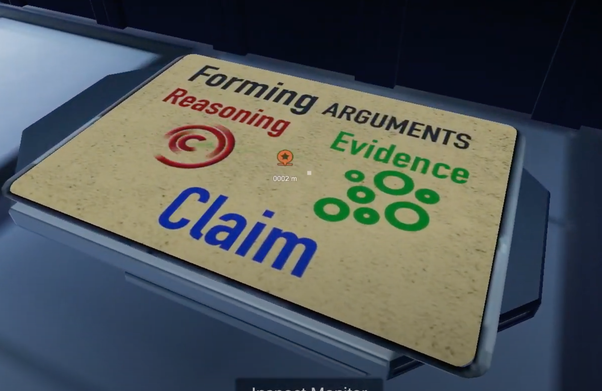

## Slide 3

\#1 Parts of Argument: Proposed Update (Cinematic Introduction)

\*Presented in U1

TOPPO

Good morning, cadets. Today in our survival skills series, we’ll be covering: scientific argumentation.

## Slide 4

\#1 Parts of Argument: Proposed Update

In science, argumentation is the process of using knowledge, facts, and logic to support an idea or concept.

\*Presented in U1

Scientific arguments seek to answer a driving question- this is an unanswered question about something in the environment. 

Argumentation

Why is the sky blue?

How do birds fly?

Are there other universes?

Why does ice float?

Where does rain come from?

(random questions swirling about)

(Other visuals?)

A complete argument contains three parts – a claim, evidence, and reasoning.

?

## Slide 5

\#1 Parts of Argument: Proposed Update

\*Presented in U1

Claim

Evidence

Claim

Claim

Evidence

The claim is a statement that answers the driving question. 

Evidence is scientific data and facts that support your claim. 

Finally, r easoning links your claim to the evidence presented by explaining how or why the evidence supports the claim.

Reasoning

## Slide 6

\#1 Parts of Argument: Proposed Update (Cinematic Outro)

\*Presented in U1

TOPPO

A good scientific argument can convince others to follow your lead, even if it’s through a cave of carnivorous alien plants.

## Slide 7

\#2 Topographic Maps: 1.0 Version

ARF: “ It looks like this video shows you how to read a topographic map. Notice that where the contour lines are close together there are very steep mountains. Where the contour lines are far apart there is flat land.”

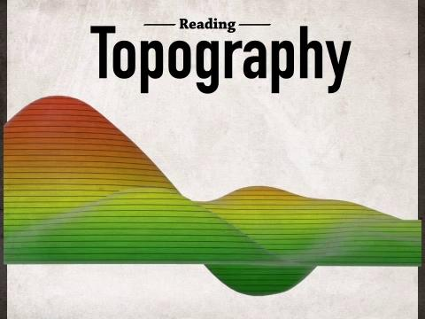

\* Presented in U 1

## Slide 8

\#2 Topographic Maps: Proposed Update  (Cinematic Introduction)

\*Presented in U1

TOPPO

Good morning, cadets. Today in our survival skills series, we’ll be covering: topographic maps.

## Slide 9

Note: T errain similar to this with visible contour indices as shown below (the elevation  labeled  and lines bolded every 5 lines) would be awesome

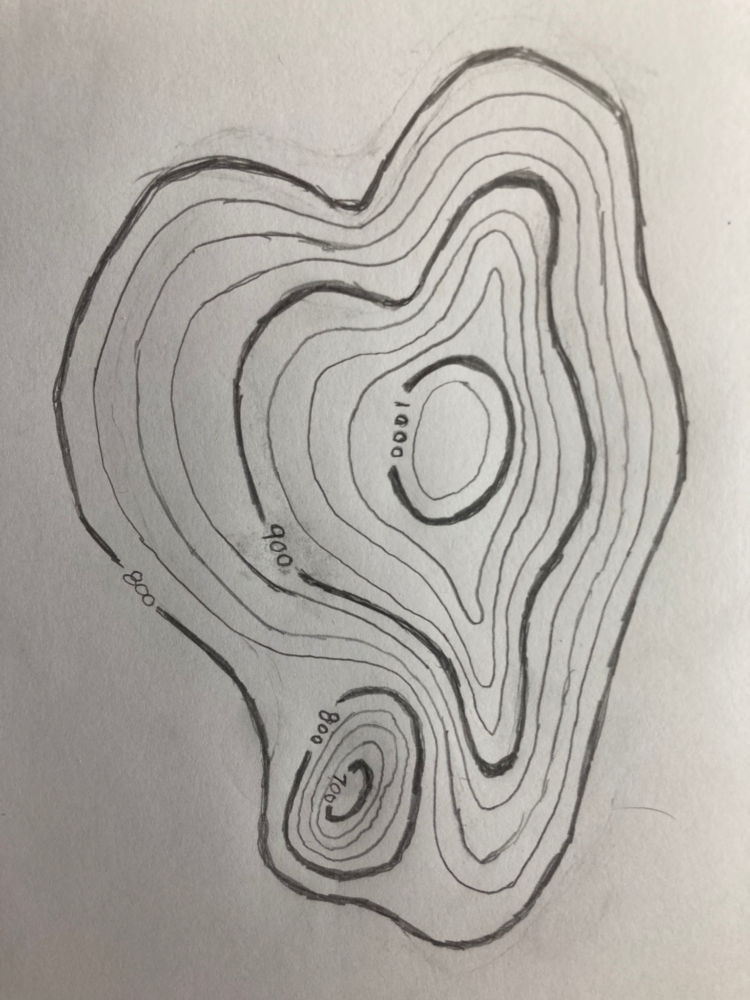

\#2 Topographic Maps: Proposed Update

## Slide 10

“ This is a topographic map. It’s a special map that provides information about the physical  features  of a planet’s surface in a 2D format through lines drawn on the map called  contour lines .” 

\#2 Topographic Maps: Proposed Update

\*Presented in U1 by Toppo 

View starts on flat topographic map

View pans out and tilts depicting 3D surface and ends on side view of terrain (basically the same as the 1.0 video only slower and only tilts once)

View slowly tilts back and returns to flat map

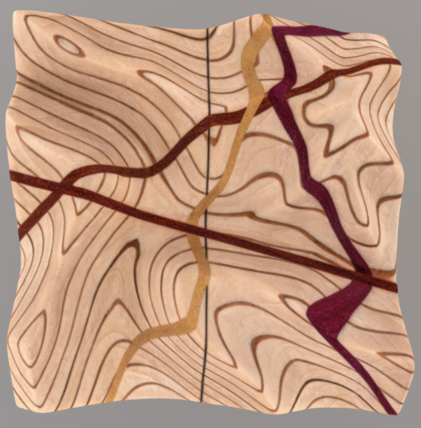

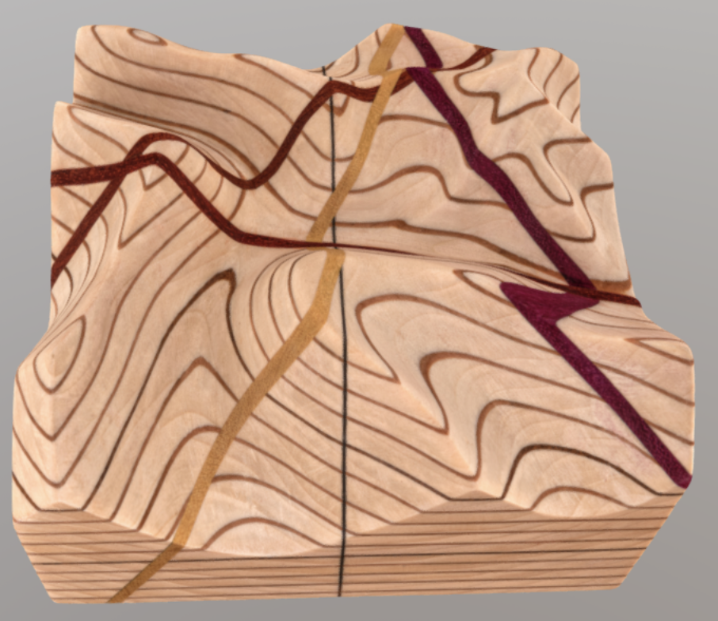

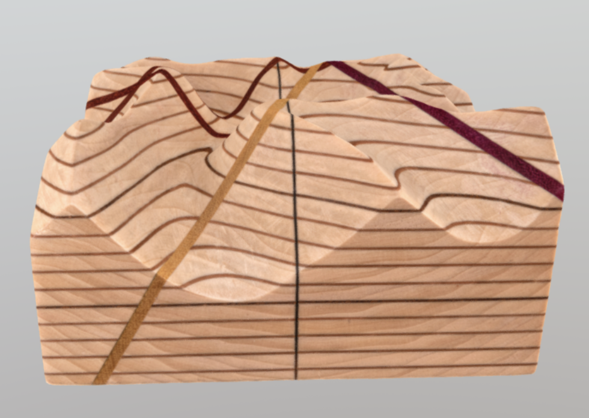

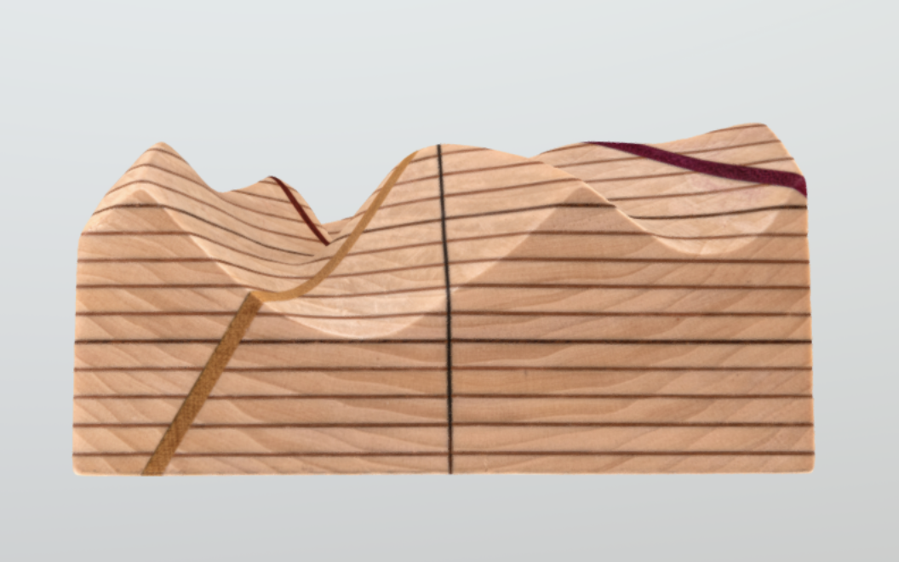

## Slide 11

“ Contour lines connect points with the same elevation- or height above sea level. They show how elevation changes across the landscape. ”  

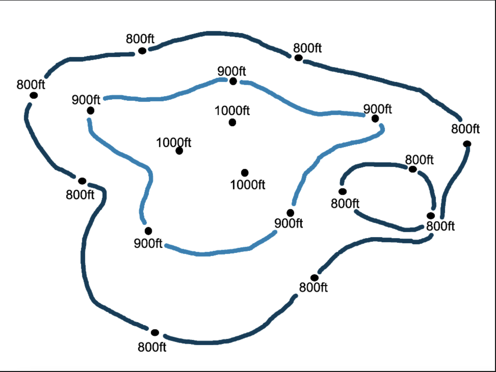

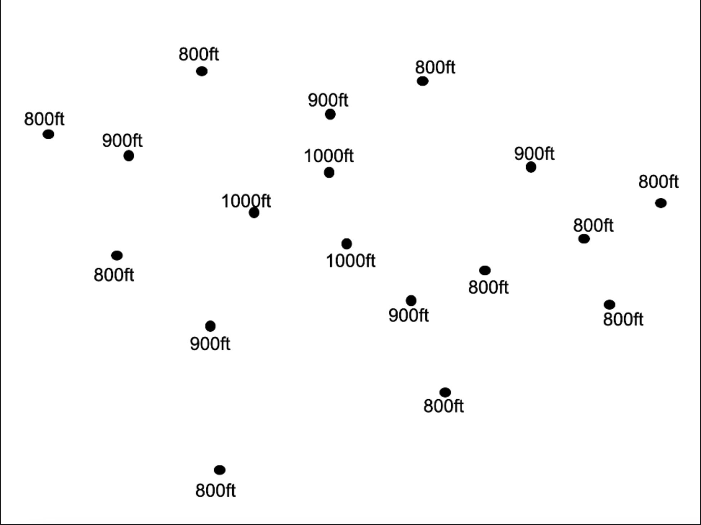

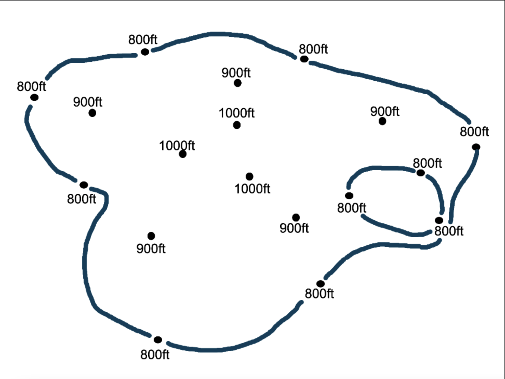

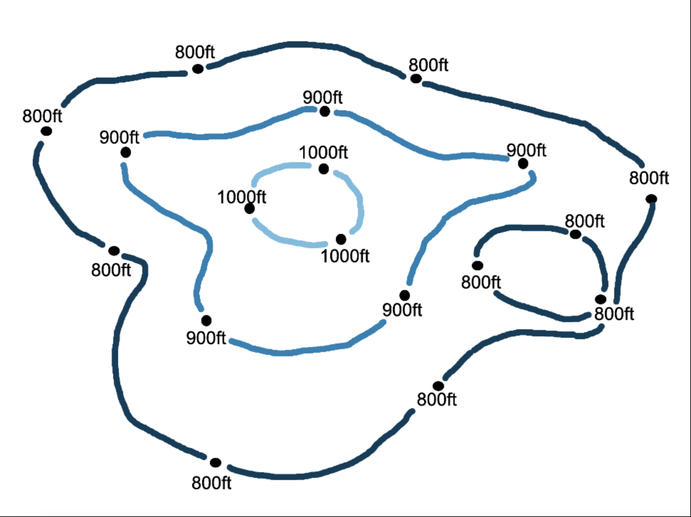

Labeled elevation points scatter in across the terrain

Elevation dots that are the same connect…

Eventually terrain has all contour lines laid across it with only contour  indices  labeled

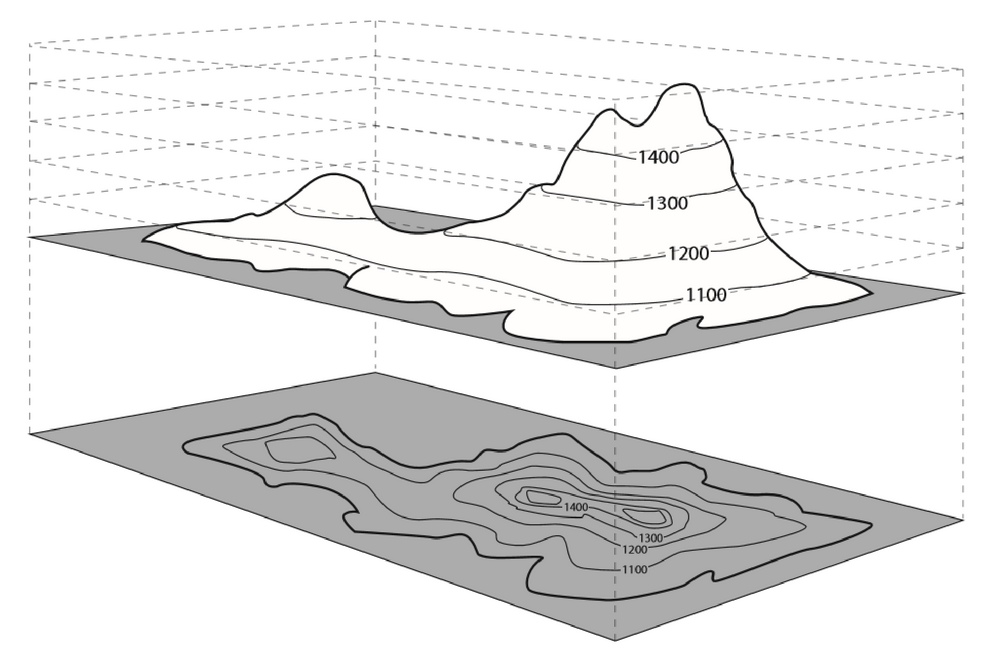

View tilts to show contour lines/ indices  overlaid  on 3D terrain similar to this image?

## Slide 12

“When contour lines are close  together, it means the elevation is changing a lot over a short distance- in other words, there are steep slopes.”

View centers on this region of terrain (three-quarter view from left side to show height?)

Labeled  “Steep Slope” on screen

## Slide 13

“When contour lines are farther apart, it means the elevation is changing gradually- the area has a gentle slope.” 

View centers on this region of terrain (three-quarter view from left side to show height?)

Labeled “Gentle Slope” on screen

## Slide 14

“Topographic maps can be used to identify hilltops, ridges, depressions, valleys, and  more .”  

Goes through each area and highlights/ labels on 2D map then view tilts to show in in 3D?

## Slide 15

\#2 Topographic Maps: Proposed Update (Cinematic Outro)

\*Presented in U1

TOPPO

A topographic map can mean the difference between safely finding your way back to base or stumbling blindly off a cliff.
