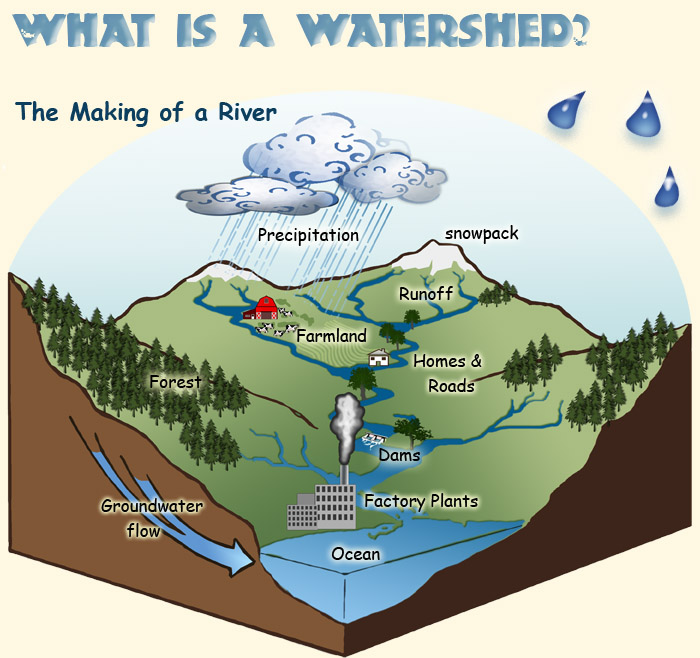
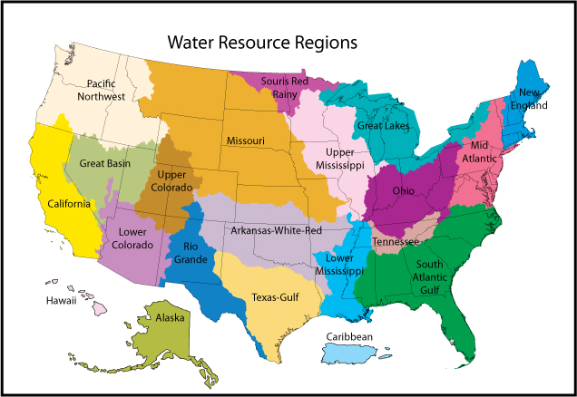
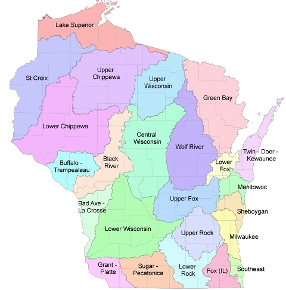
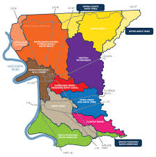

## U2 Toppo Lessons

Proposed Updates for MHS 2.0

Note: This is a draft document- updated versions of this can be found here  https://miro.com/app/board/uXjVM22X5Lc=/  

## Slide 2

\#3 Watershed: 1.0 Version

ARF: “It seems like this glyph is about watersheds .  A watershed is an area of land that includes all the streams and rivers that flow together and eventually go out to sea. It also seems that larger watersheds will have more water flowing through them... that seems important. Wait.. what is this… what is the moon doing there it seems a bit out of place.”

\*There wasn’t a Toppo Poster for this concept in 1.0. Instead a glyph covered this information.

\*Presented in U2

## Slide 3

\#3 Watershed: Proposed Update  (Cinematic Introduction)

\*Presented in U2

TOPPO

Good morning, cadets. Today in our survival skills series, we’ll be covering: watersheds.

## Slide 4

“ T his is a diagram of a watershed. A watershed is an area of land that drains or “sheds” its water into a common body of water.” 

\#3 Watershed: Proposed Update

\*Presented in U2

3D depiction of a watershed similar to this but no factory/ labels. Water can be seen flowing downhill.

## Slide 5

“When it rains, water flows  downhill  from source waters within the watershed, collecting in creeks that feed into larger streams, rivers, and eventually down to the ocean.” 

\#3 Watershed: Proposed Update

\*Presented in U2

Same imagery but it begins to rain. Water continues to flow downhill.

## Slide 6

“Watersheds  come in a wide range of shapes and sizes, but every piece of land is part of a watershed.  The bigger a watershed is, the more water flows through it. ” 

\#3 Watershed: Proposed Update

\*Presented in U2

Zooms out to depict multiple watersheds on a fictional map? Similar to these but not of united states. 

## Slide 7

\#3 Watershed: Proposed Update (Cinematic Outro)

\*Presented in U2

TOPPO

Identifying a plentiful watershed will prevent the team needing to drink their own filtered wastewater to survive.
