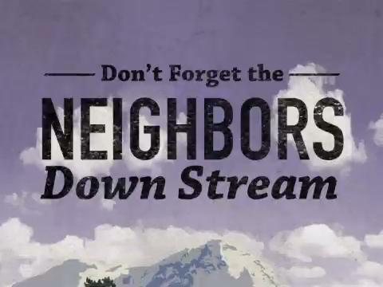
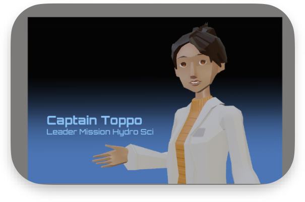
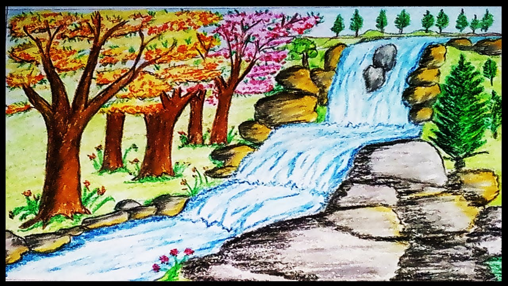
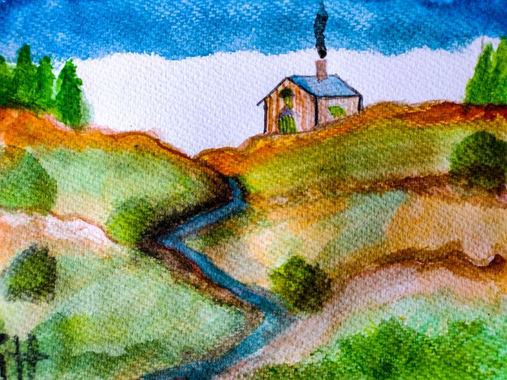
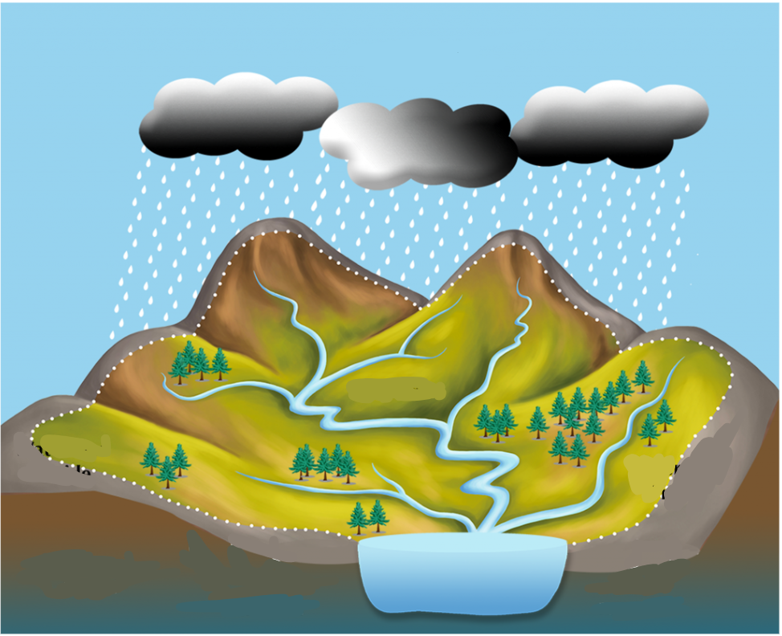
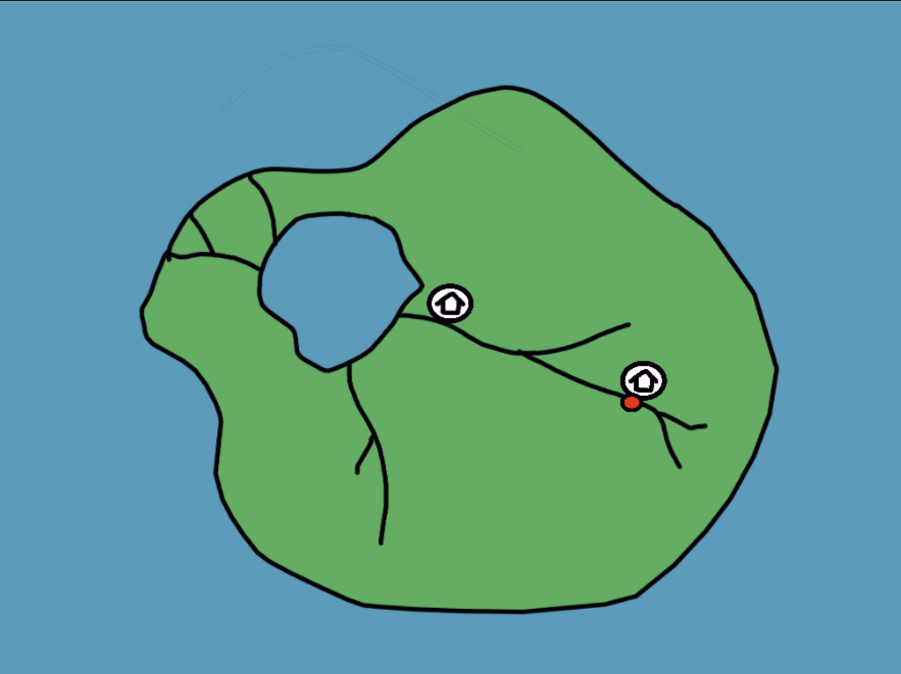
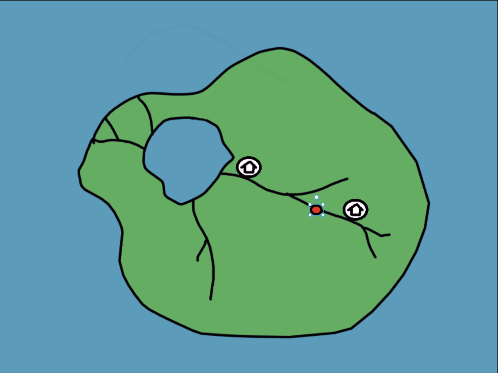
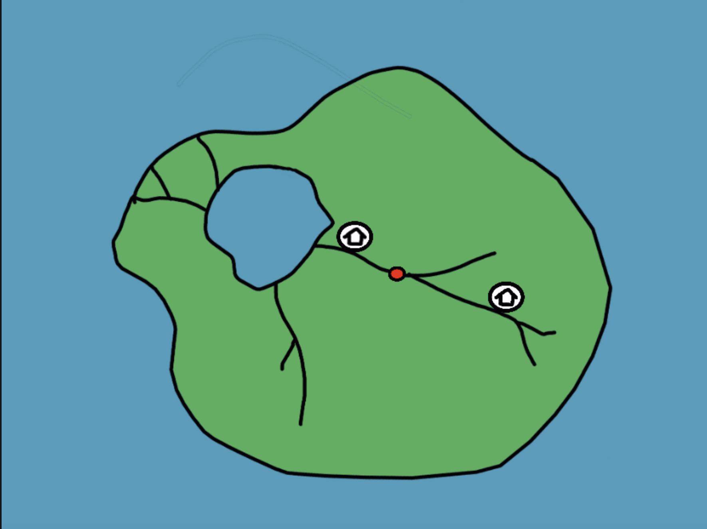
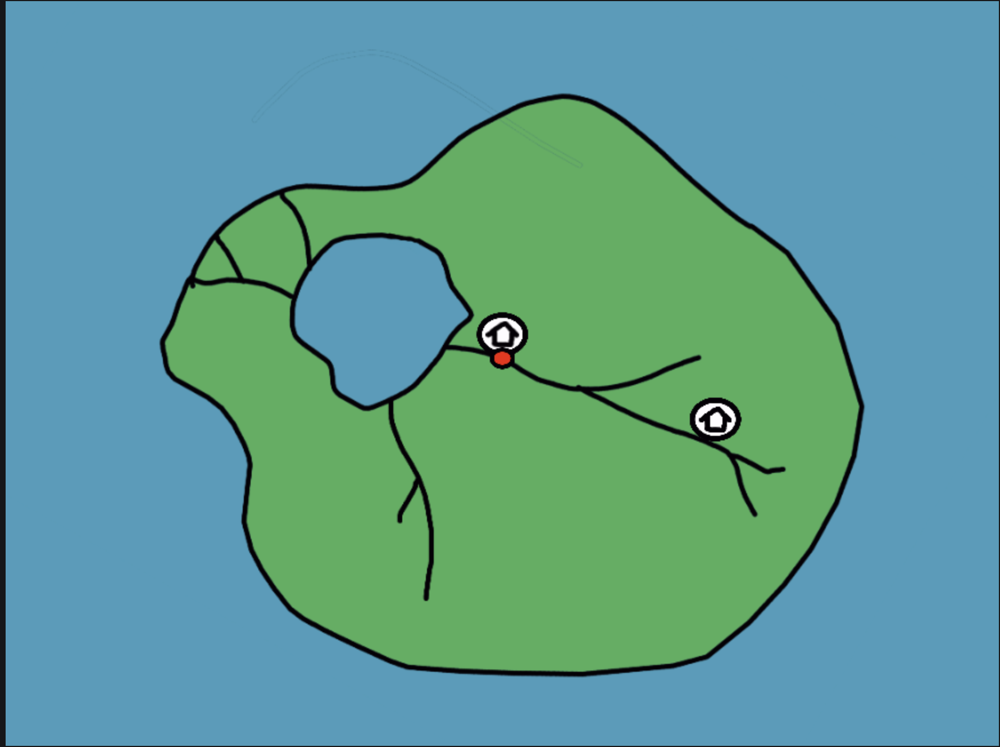
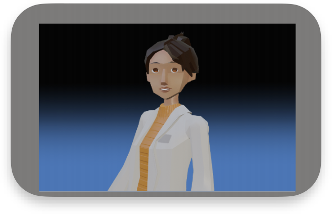

## U3 Toppo Lessons

Proposed Updates for MHS 2.0

Note: This is a draft document- updated versions of this can be found here  https://miro.com/app/board/uXjVM22X5Lc=/  

## Slide 2

\#4 Water Flow: 1.0 Version

ARF: “Good advice cadet. Remember that when you dump anything bad in the water it will flow downstream. If you have any neighbors downstream, their water will be polluted due to your actions.” 

\*Presented in U3

## Slide 3

\#4 Water Flow: Proposed Update  (Cinematic Introduction)

\*Presented in U3

TOPPO

Good morning, cadets. Today in our survival skills series, we’ll be covering: water flow.

## Slide 4

\#4 Water Flow: Proposed Update

\*Presented in U3

“ Elements dropped in water will flow from areas of high elevation to areas of lower elevation due to the force of gravity.” 

Short visual sequence of water flowing downhill in a terrain with clear area of high and low elevation like these images. 

## Slide 5

\#4 Water Flow: Proposed Update

“ If you have neighbors that live at a lower elevation on a body of water or "downstream" from you, their water might be polluted due to your actions.”

Visual of  something  (like a bottle of juice?) being thrown into water and floating in the water downhill. 

## Slide 6

\#4 Water Flow: Proposed Update

\*Presented in U3

Visual that shows water pollution (red dot on image below) moving on a map like the one below from one location to another.

“ Even dissolved materials your eyes can’t see get carried  downstream .”

(These icons could be bigger/better more effective at conveying their meaning and don’t need  necessarily  be labeled) 

“Neighbor” location

Pollution source

Note: We definitely want the flow of this river to be south to north on the map. It can actually be even more extreme than this image if we want. We just really want to represent that downward (downstream) flow in a river doesn’t necessary mean north to south direction on a map (common student misconception). 

## Slide 7

\#4 Water Flow: Proposed Update (Cinematic Outro)

\*Presented in U3

TOPPO

Avoiding using water downstream of a source of contamination may just save the team from crippling dysentery.
