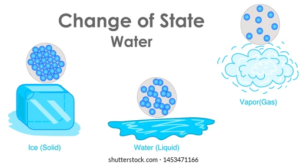
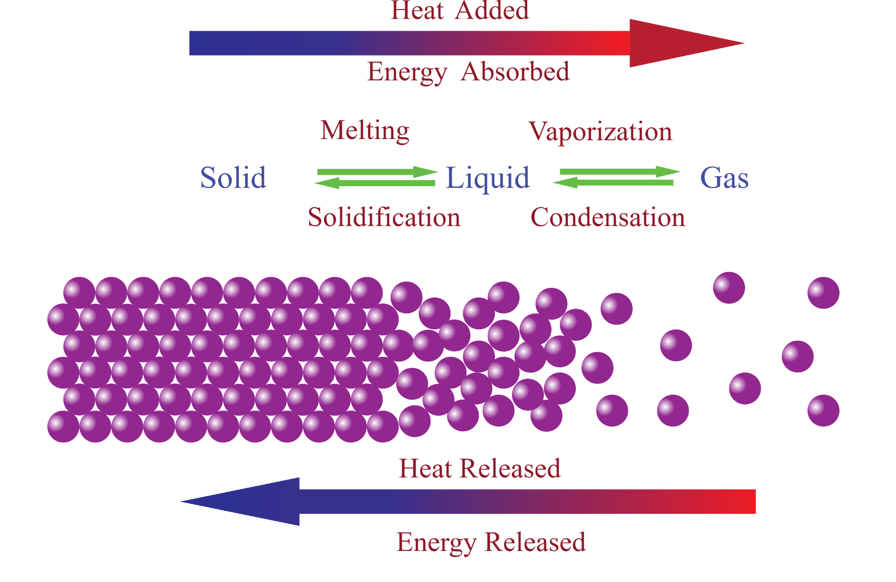
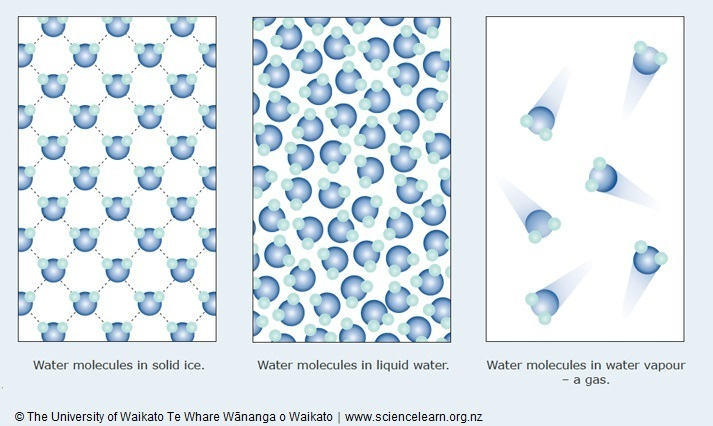
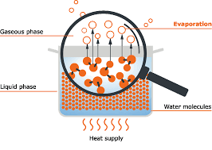
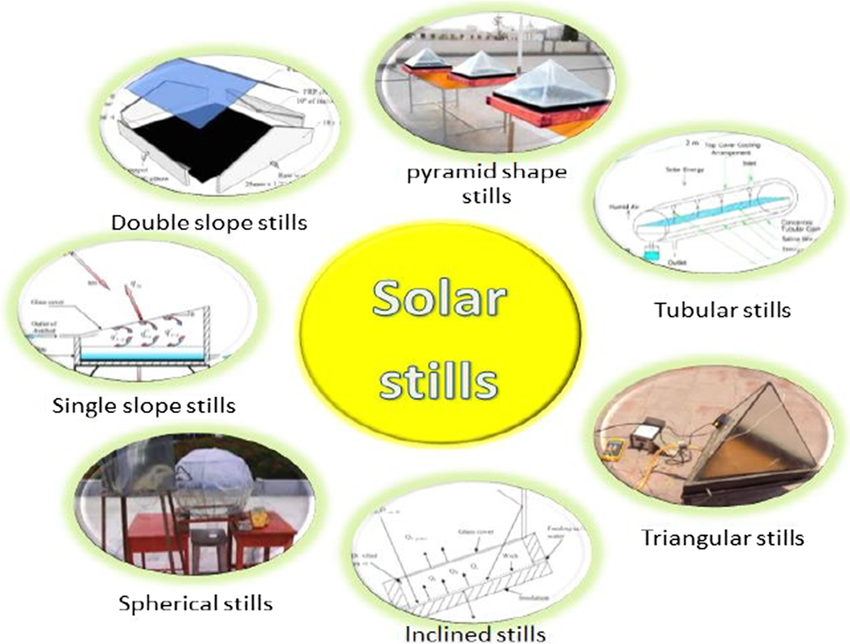
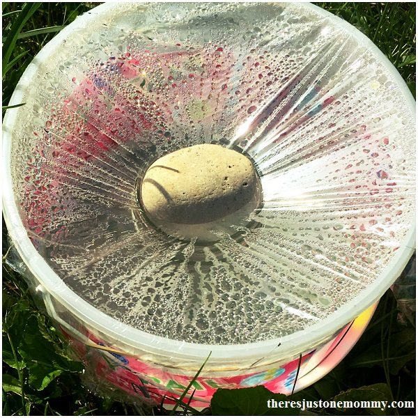
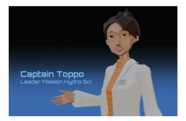

## U5 Toppo Lessons

Note: This is a draft document- updated versions of this can be found here  https://miro.com/app/board/uXjVM22X5Lc=/  

## Topics to Include

- Evaporation definition/ example
- Condensation  definition/ example
- Role of temperature in phase change/ evaporation rate (visualization of particle motion)
- Sun as energy source for water cycle
- Role of the ocean in the water cycle on Earth

## \#1 Evaporation & Condensation

## Slide 4

Water can be found in several different forms. 

## Slide 5

S ometimes it’s found in a liquid form as we’ve discussed in past lessons…

## Slide 6

…  but you can also find water in the form of a gas throughout the atmosphere. 

## Slide 7

In order for water to change forms, energy must be added or removed- this often occurs by changing its temperature. 

## Slide 8

As the temperature of water increases, its particles gain energy and begin to move faster and spread out. 

## Slide 9

If the particles gain  enough  energy, they can transition from a liquid to a gas.

## Slide 10

The process of a liquid turning into a gas is called evaporation.

## Slide 11

As the temperature of water decreases, its particles lose energy and begin to move slower and clump together. 

## Slide 12

If they continue to lose energy, the water will eventually turn back into a liquid.

## Slide 13

The process of a gas turning into a liquid is called condensation.

## Slide 14

Evaporation and condensation are also seen on a larger scale all around us …

## Slide 15

Surface water from sources like the ocean, lakes, and rivers can evaporate as energy from the sun causes its temperature to increase.

## Slide 16

Increased  evaporation results increased humidity. Humidity is a measure of the amount of gaseous water in the air.

## Slide 17

As the gaseous water rises it will encounter colder and colder temperatures in the atmosphere… 

## Slide 18

Eventually, the temperatures will become so cold that water condenses, changes into liquid form, and falls from the sky as rain.

## \#2 Solar Desalinator

## Slide 20

On a small scale we can see this cycle at work inside a solar desalinator. This is a simple tool that uses the energy from the sun to turn salt water into fresh water. Some are simple and some are complex, but they all work the same way.

## Slide 21

First, salty water enters a chamber.

(Visual of salt water added to two different style stills)          

## Slide 22

Then the sun heats up the salt water. 

(Visual of sun heating water…)          

## Slide 23

When it gets hot enough it will start to evaporate leaving the salt behind.

(Visual of water evaporating and salt remaining in relevant area)          

## Slide 24

After the water evaporates, the vapor reaches a cool surface like glass or plastic. This causes the water to become colder and condense. 

## Slide 25

The condensation drips down into a storage area where you can collect it as fresh water.

## Slide 26

A desalinator can keep you alive if you’re ever shipwrecked. Not that MHS brought any boats.

## Brainstorm

https://phet.colorado.edu/sims/html/states-of-matter-basics/latest/states-of-matter-basics_en.html  

