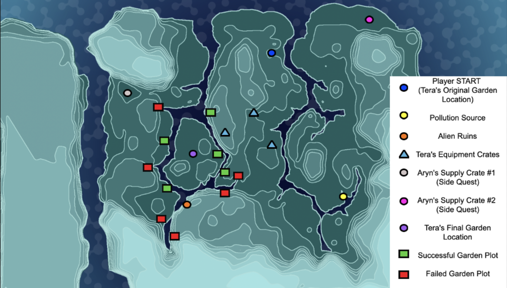

## U3 Map Locations

## Slide 2

OUTDATED

## Supply Run

Legend

	- Teleporter Arrival

	- Tera’s First Camp

	- Tera’s Supplies

	- Crate Movement Path

	- Tera Picks Up Crates

    (A) 	- Player Steps (Linked to Combo Doc)

Side Quests

	- Aryn’s Crates

\(A\)

\(B\)

\(C\)

## Pollution Solution

\(A\)

Legend

	- Tera’s Updated Camp

	- Pollution Sensor Crate

	- River Flow Direction

	- Polluted Water

	- Clean Water

	- Pollutant

    (A) 	- Player Steps (Linked to Combo Doc)

Side Quests

	- Deer  Range

	- Bird  Range

\(B\)

\(C\)

\(D\)

\(E\)

\(F\)

\(G\)

## Forsaken Facility

Legend

	- Tera’s Pristine Camp

	- Alien Ruin Entrance

    (A) 	- Player Steps (Linked to Combo Doc)

\(A\)

\(B\)

(\*)

## Planting Superfruit

Legend

	Successful plot

	Failed plot

\[A\]: Nutrient source/ ruin exit

\[B\]: Tera’s new camp site

\(A\)

\(B\)
