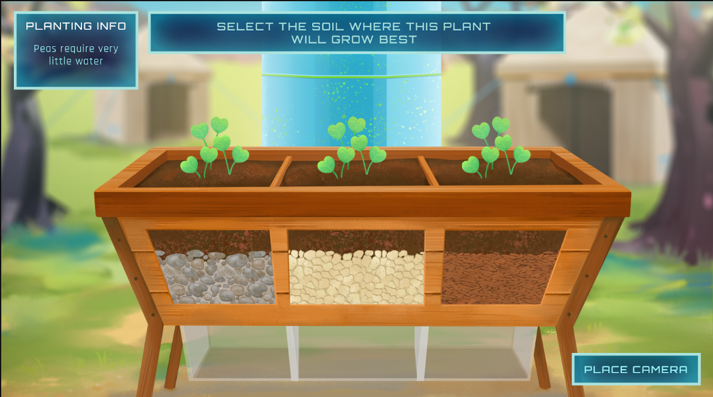
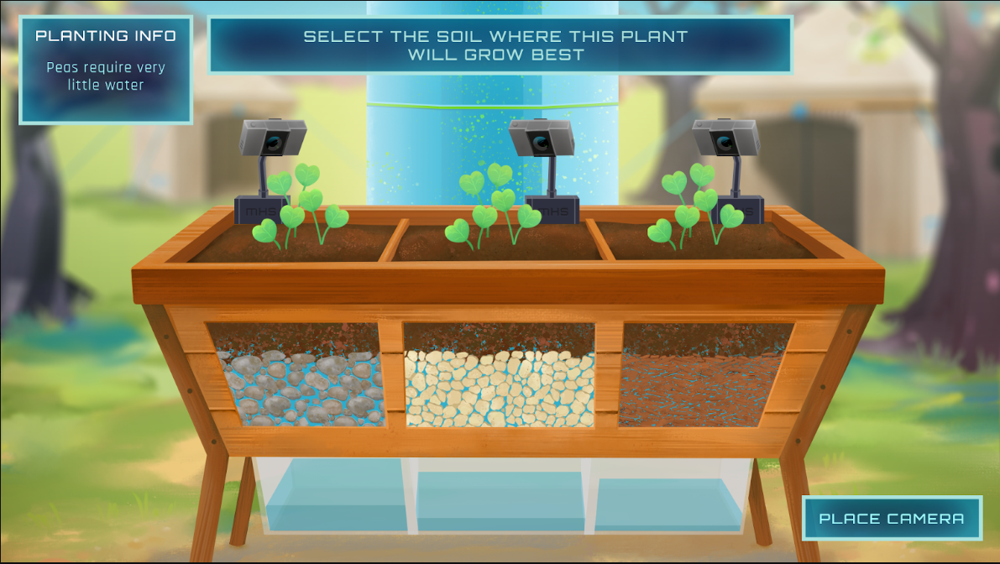
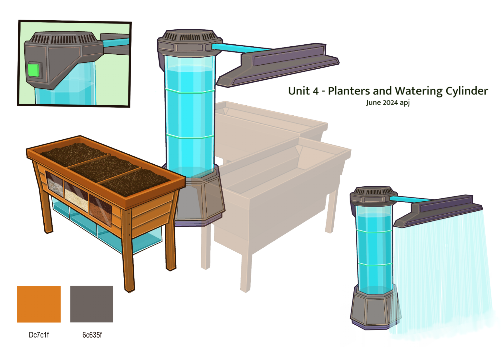
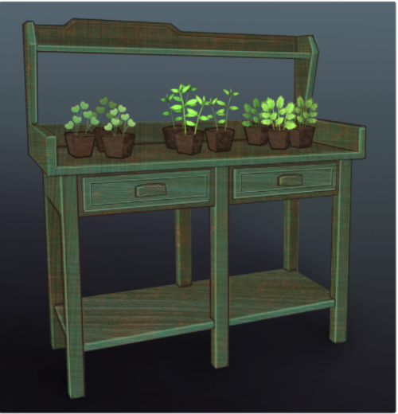
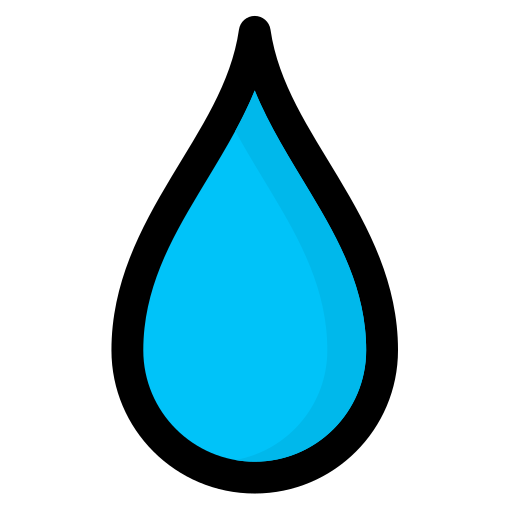
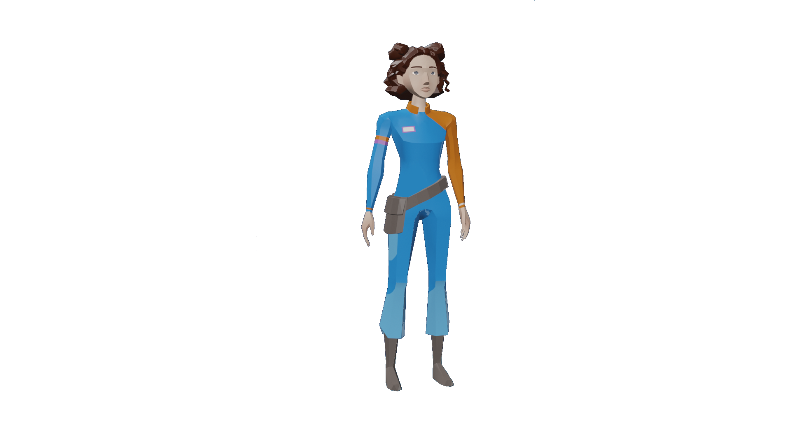
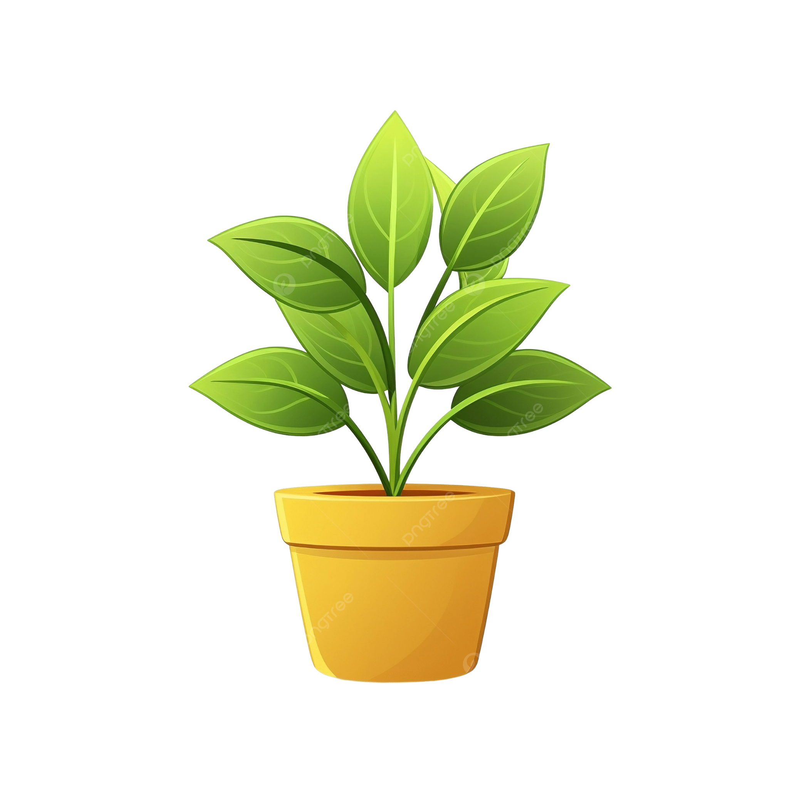
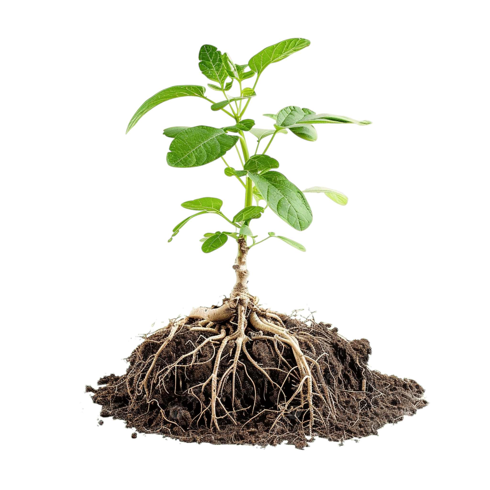

## Slide 1

Tera’s Garden Boxes

Design Documentation

Quest Objective

Choose the soil type that will best suit each plant

Core Concept 

Use understanding of soil infiltration to determine where to best plant crops with differing water requirements.

Performance Determining Factors

Correct- plant crop in correct soil type for water needs

Incorrect- plant crop in incorrect soil type for water needs

## Slide 2

Plain English Description

After saving Anderson from her lab, Tera asks for the players help in setting up cameras to capture plant growth for her live stream at Anderson’s base. 

The player is given three types of plants to place in garden planters. Tera wasn’t sure which soil would be best for each type of plant so she put three types of soil in each planter (clay, sand, gravel). 

Tera only has 3 cameras with limited range. She wants to set up a camera pointing at the plant in each planter that will grow the best, but she’s not sure which to choose and asks the player for their expertise. 

P layers must choose one plant at each planter to video based on their understanding of water infiltration rates through different soil types. 

## Current Misalignments

- Missing art assets (watering devices)
- UI should take up whole screen 
- Missing watering  animation  to show that all planters are watered with the same exact amount of water (slide 9, item 1 /  here  in combo doc)
- Missing dynamic feedback sequence (slides 12-13)
- Amount of water underneath the different soil types is not correct (the amount should be soil dependent)(see images below)

Post-watering animation: all UI should look like this 

Pre-watering animation: all UI should look like this

## Slide 4

Broad Overview of Events

Player grabs all seedlings of the same type from table 

Player plants all 3 seedling of that type in a specified planter

Player views watering animation via UI pop-up

Player selects camera location in UI

Repeat steps 1-4 until all 3 types of plants are planted and all cameras are placed

Player interacts with supernutrient activation panel to “lock” in answers trigger animation of supernutrient release

Animation or cinematic of plant growth occurs and feedback is given

## Slide 5

Seedling Table

Superfruit Orange Tree 

OR

Broccoli 

Mega Turnip 

OR

Potatoes

Ultra Corn 

OR

Peas 

Planter #1

Planter #2

Planter #3

The availability of plants offered in this unit is determined by  Unit 3’s Task 2.3 Plant the Superfruit Seeds . 

If players got 3 or more correct garden plots in U3- available seedlings include superfruit orange tree, ultra corn, and mega turnip

If players got less than 3 correct garden plots in U3- available seedlings include broccoli, peas, potatoes 

SET-UP

(ultra corn/peas)

(mega turnip/potatoes)

(superfruit orange/broccoli)

## Slide 6

Seedling Table

Superfruit Orange Tree 

OR

Broccoli 

Mega Turnip 

OR

Potatoes

Ultra Corn 

OR

Peas 

Planter #1

Planter #2

Planter #3

Note: Plants will be collected in a specific order upon approaching the table and deposited to a specific planter to simplify dev/cinematic sequencing

(ultra corn/peas)

(mega turnip/potatoes)

(superfruit orange/broccoli)

## Slide 7

Seedling Table

Superfruit Orange Tree 

OR

Broccoli 

Mega Turnip 

OR

Potatoes

Ultra Corn 

OR

Peas 

Planter #1

Planter #2

Planter #3

(ultra corn/peas)

(mega turnip/potatoes)

(superfruit orange/broccoli)

## Slide 8

Seedling Table

Superfruit Orange Tree 

OR

Broccoli 

Mega Turnip 

OR

Potatoes

Ultra Corn 

OR

Peas 

Planter #1

Planter #2

Planter #3

(ultra corn/peas)

(mega turnip/potatoes)

(superfruit orange/broccoli)

## Slide 9

Planter #1

Planter #2

Planter #3

Peas require very little water

Options h ighlight on hover

Place Camera

Clickable only after option selected

Click to select

(ultra corn/peas)

(mega turnip/potatoes)

(superfruit orange/broccoli)

## Slide 10

Planter #1

Planter #2

Planter #3

Peas require very little water

Place Camera

Click to submit

(ultra corn/peas)

(mega turnip/potatoes)

(superfruit orange/broccoli)

## Slide 11

Planter #1

Planter #2

Planter #3

Seedling Table

Superfruit Orange Tree 

OR

Broccoli 

Mega Turnip 

OR

Potatoes

Ultra Corn 

OR

Peas 

(ultra corn/peas)

(mega turnip/potatoes)

(superfruit orange/broccoli)

Note: If player wishes to change the placement of a camera in a previous planter they can return to the planter, press E to interact, trigger the UI and reselect up until they confirm their choice with DANI.

## Slide 12

Planter #1

Planter #2

Planter #3

(ultra corn/peas)

(mega turnip/potatoes)

(superfruit orange/broccoli)

## Slide 13

| Plant | Camera Placement | Feedback  |
|----|----|----|
| Superfruit Orange Tree or Broccoli | Small Particles (Clay) | You chose the best soil for this plant. It received the ideal amount of water. |
| Mega Turnip  or Potatoes | Medium Particles (Sand) | You chose the best soil for this plant. It received the ideal amount of water. |
| Ultra-Corn  or Peas | Large Particles (Gravel) | You chose the best soil for this plant. It received the ideal amount of water. |
| Superfruit Orange Tree or Broccoli | Medium Particles (Sand) | This plant did not get enough water. The water is expected to pass through the soil particles too easily and not pool around it’s roots.  |
| Superfruit Orange Tree or Broccoli | Large Particles (Gravel) |  |
| Mega Turnip  or Potatoes | Small Particles (Clay) | This plant got more water  than it required. The small soil particles will trap water and hold too much of it near  its  roots.  |
| Mega Turnip  or Potatoes | Large Particles (Gravel) | This plant did not get enough water. The water is expected to pass through the soil particles too easily and not pool around it’s roots.  |
| Ultra-Corn  or Peas | Small Particles (Clay) | This plant got more water than it required. The small soil particles will trap water and hold too much of it near its roots.  |
| Ultra-Corn  or Peas | Medium Particles (Sand) |  |

Would probably be good to have something unique for each of these to avoid repetition.
