## Unit 4 Brainstorm

Summary of U4 in 1.0  

## Learning Objectives

Water Science

W4.1 Predict the location of the water table based on the saturated (region below the water table where all open spaces are filled with water) and unsaturated zones (region immediately below the land surface that contains air and water).  (drill ruins, argumentation)

W4.2 Predict rates of infiltration based on the permeability of the underlying substrate. (drill ruins, argumentation, filtration mini-game)

W4.3 Explain movement of water from the surface system to the ground system. ( drill ruins, argumentation)

Argumentation

A4.1 Students will generate a complete argument (claim, reasoning, evidence)  (argumentation)

A4.2 Identify a faulty argument provided (incorrect use of evidence in an argument)  (argumentation)

## Assessment Questions

1. Of the two wells in the picture above, which will likely have the cleanest water? 

Well A  

Well B  

The same  

2. Will water flow most  easily  through sand, gravel, or clay? 

Sand  

Gravel  

Clay  

3. Water will flow most slowly through which material? 

Sand   

Gravel  

Clay  

For the following items, refer to the image below, which represents a cross-sectional view of the underground space close to two wells.

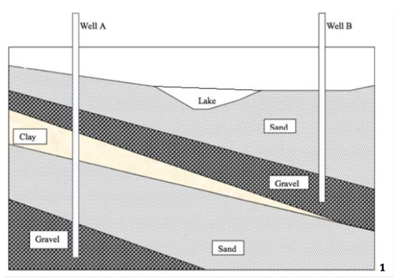

## Assessment Questions

For the next two items, consider the following diagram of two different soils.

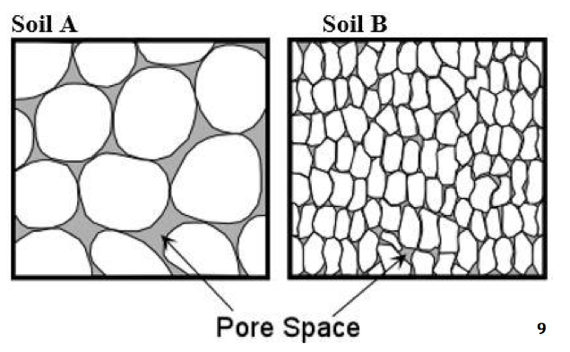

10. Which soil will  hold  the most water? 

- Soil A  
- Soil B  
- No difference  

11. Students in science class added water to both Soil A and Soil B. They found that water was able to move quickly through Soil A, but not Soil B. Why can water move quicker through Soil A than Soil B? 

- Soil B is harder than Soil A  
- Soil B is made up of smaller particles than Soil A  
- Soil B has less space between the particles than Soil A  

## Curricular Suggestions

## Overview

- Key terms need additional defining and concept reinforcement

<!-- -->

- water table
- Infiltration
- saturated vs unsaturated zones
- aquifer?
- porosity/permeability?

(All terms are mentioned in DANI dialogue but not explicitly defined anywhere)

- Narrative confusion points

<!-- -->

- Argumentation confusion? Leak responsible for fountains flooding bunker?
- Last task confusion (flooding fountains to divert water to wells that we flood to make a lake?)

- Visual improvements 

<!-- -->

- Soil layers
- Soil particle depiction throughout unit
- Generators in first dungeon 

## “Well Drill” Dungeon 

Players discover well drill with no power. Take elevator to  investigate . Get stuck at bottom floor of dungeon. Player must turn power on by solving puzzles on each level eventually enabling power to the drill where they must choose which depth to drill their well in order to reach the water table.

## Well Dungeon  Notes

- Anderson should be the one who sends you to start up this well and get it working at any cost–that they need to get access to water in the area as it’s quite arid on the surface
- This interior and exterior of the dungeon should ideally look aesthetically pleasing. 

<!-- -->

- Exterior, think a scoped down (½ acre) oil refinery, if made in the future with white material, curves ,and sleek lines (lots of interlinking pipes and storage tanks)
- Contrasting it with Anderson’s cramped, patchwork, function-over-form bunker makes for an interesting contrast in both locales and scale (keeps things from feeling two same-y across the two major halves of the unit)
- Once inside– DANI: “It appears as though this structure was never finished.”
- Interior of Alien bunker: rectangular prism (square on x/y axis, much longer on z (depth) axis). Divided in half vertically (splits entire  depth  of bunker into two sides) by glass. One on half, top to bottom are the levels the Player interacts with. This side is white, alien metal with green light accents (except for the glass wall). On the other half, there is open air—and the far walls are clearly  the visible soil layers. As the Player changes levels, a thin green alien light outlines each layer (helps with camera perspective issues), and maybe DANI can pop-up a HUD or augmented reality element that states it’s XYZ soil type?
- When the player maneuvers the drill, they will see a massive drill mechanism move up and down through the open air of the glassed-off area. When they drill successfully, there will be a cinematic of the water pouring in. Then, when the Player plays next, the entire glassed area will now be full of water (indicated by an, admittedly not totally factually accurate, pleasing blue glow/cloudiness of water)

<!-- -->

- After reaching the surface, the Player should hear the frantic garbled radio call from Anderson
- The explanation: well was started, but seems like it was abandoned at the last moment–the only thing remaining is to punch the drill through into the aquifer at right layer

<!-- -->

- DANI “I cannot ascertain the reason for abandoning the  well  at this point in time.”
- Actual reason: society had already “gone holo” just before they finished the well

<!-- -->

- 

## General Ruin Design

- We might want to add some explanation for why the well is not functioning beyond the equipment not being powered. 

<!-- -->

- Was the well already successfully dug by the aliens? If so why is it not working now? Did they fill it in and we need to re-dig it?

<!-- -->

- It’s not clear that you are climbing/ moving upward between levels to different floors and how that relates to soil composition 

<!-- -->

- Add stairs/elevator + possibly a “You are Here” (except alien) style poster to each floor with a diagram of the whole area 

<!-- -->

- Layers not yet visited would be obscured in some way?

<!-- -->

- Glass elevator?

## Soil Particle View

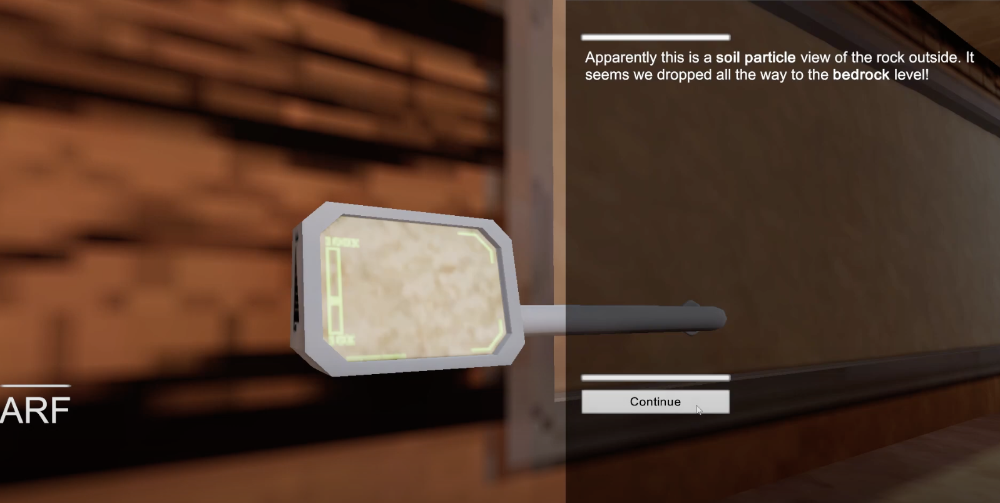

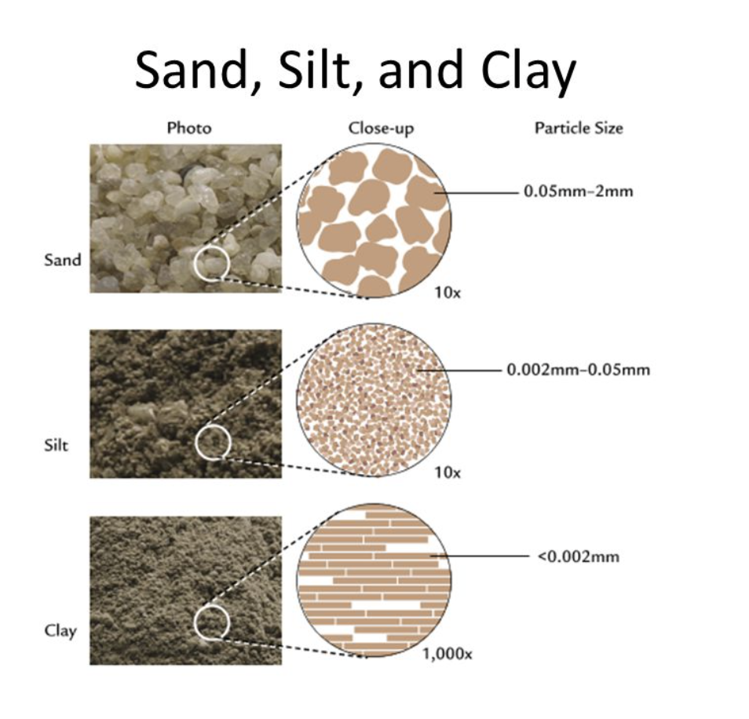

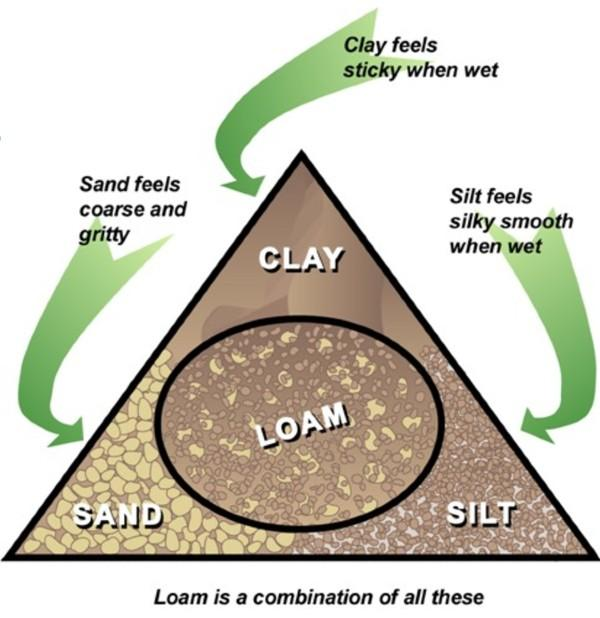

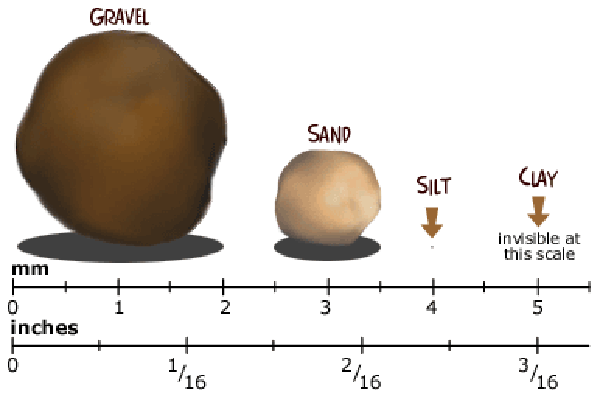

- Particle view unclear and doesn’t show water  if within water table 

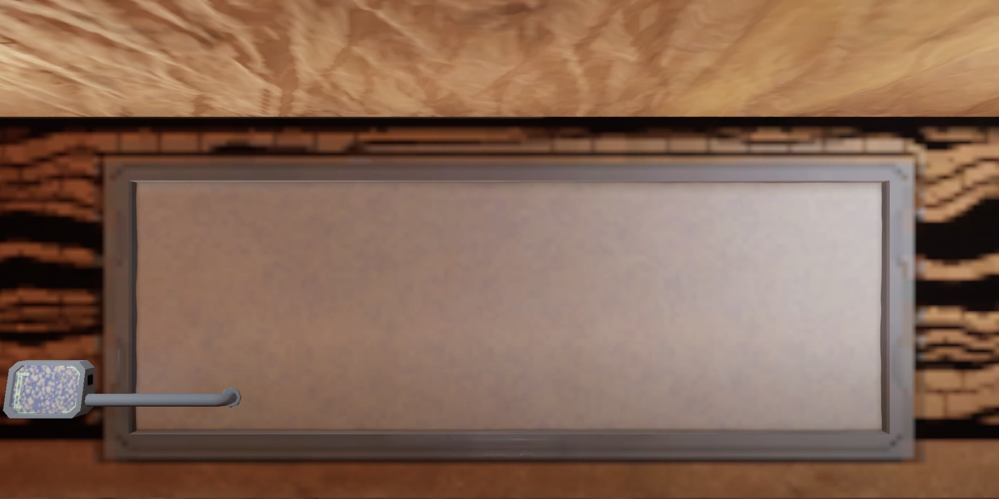

## Generators

- I’m not sure the visuals here are  adequate  depicting what is happening
- Could we make the pipes see through where the soil is?
- What are the white boxes above the pipes?

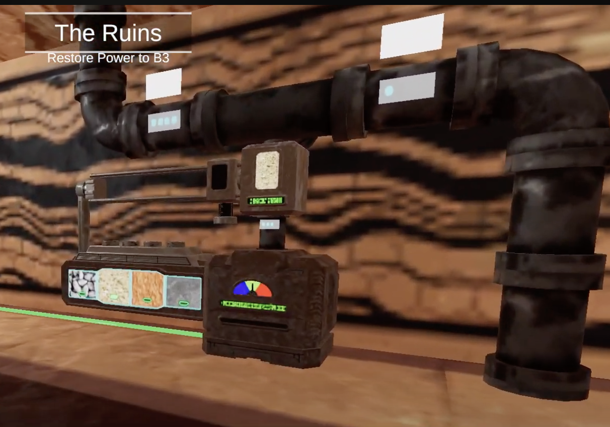

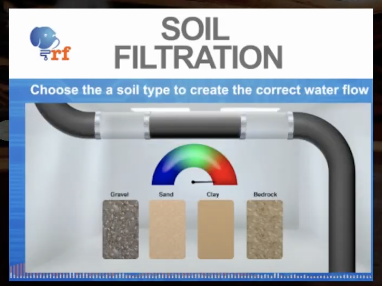

## Generators

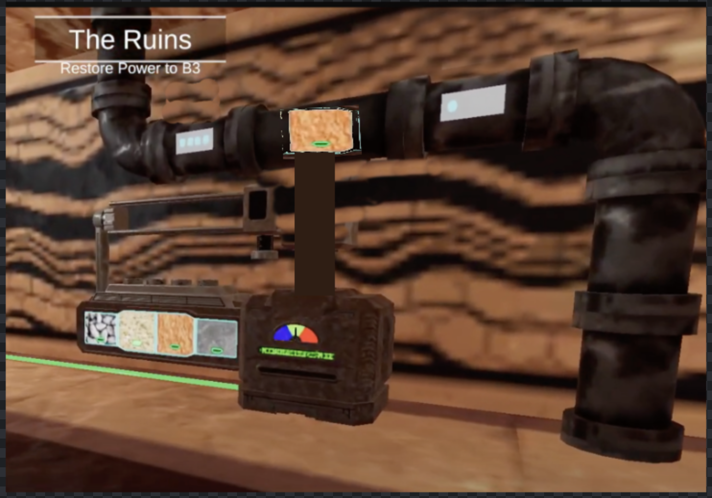

Visual indication that red is “too much” and blue is “not enough”?

Increased clarity that there is soil within the pipe and the connection that you are changing the type by choosing one of the options to the left.

Move soil view window up higher?

## Alternative Generator Design

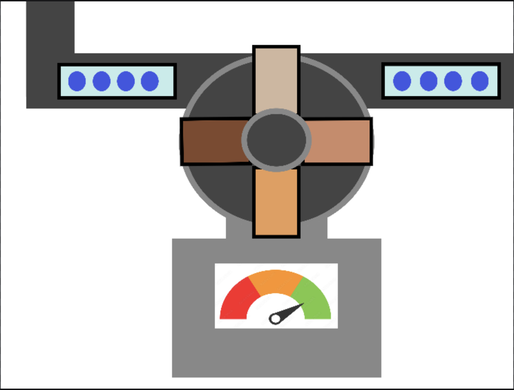

Add in soil particle views for each of the four types

Turn (or click) to adjust soil type

## Drill Design

- Update visuals so that you can clearly distinguish particle size differences
- Remove orange area (indicator for that power is on for each floor)
- Change pink drill line to look like an actual drill 
- Add clear indication that the top layer is ground level. 
- Include concept of digging further down = cleaner water 

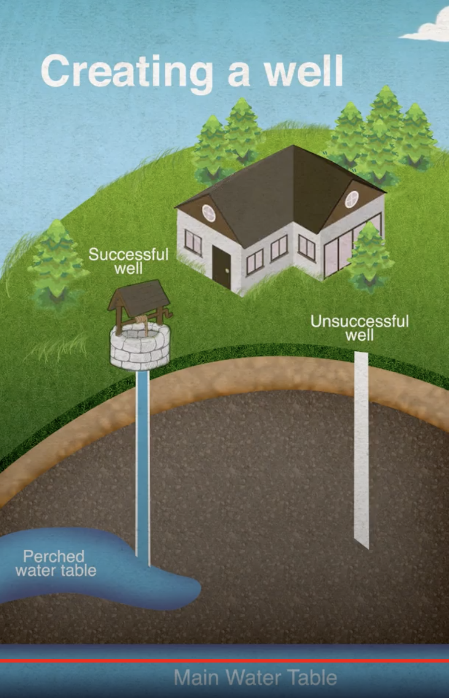

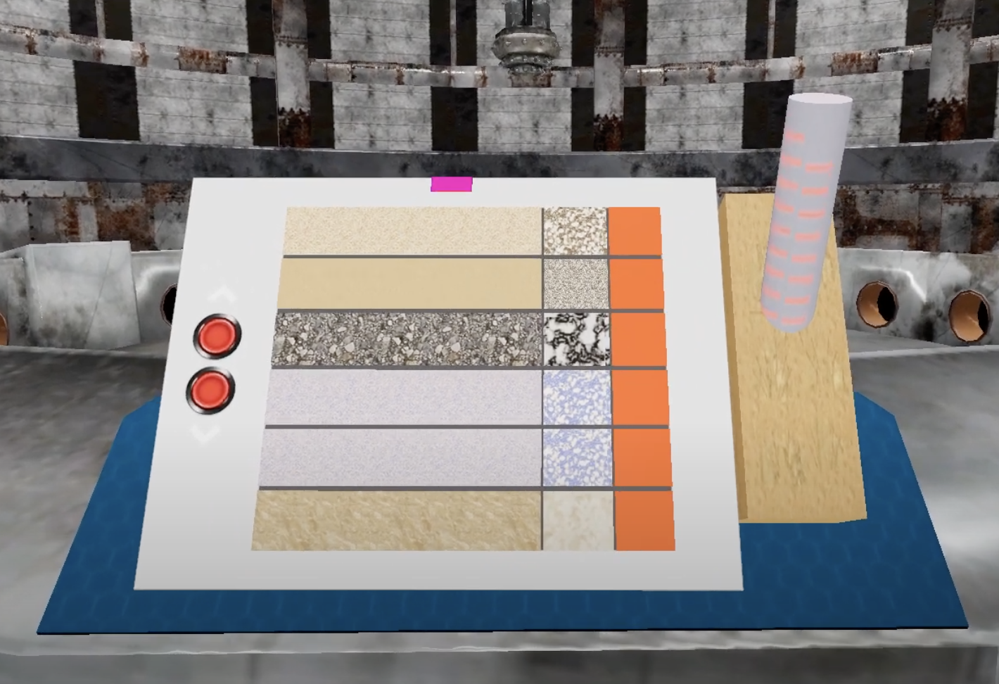

## Warehouse/Armory  Arguments

Restoring the fountains via drilling the well in the last dungeon area caused flooding in  2 regions of  Anderson’s underground bunker. Player collects evidence for argumentation by visiting bunker. Includes player building an  argument  and an  argument  critique. 

## Current Issues

- N arrative clarification that we are discussing two separate arguments 

<!-- -->

- Note: Do we want to have two separate arguments?

<!-- -->

- Evidence collection process includes a fair amount of random wandering
- Improve clarity in arguments

<!-- -->

- Why is it the players “fault” when the leaky fountain and Anderson’s poor teleportation of the bunker are a more direct cause of the flooding?

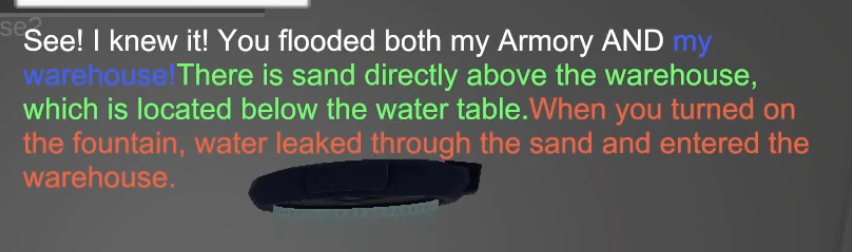

## Slide 17

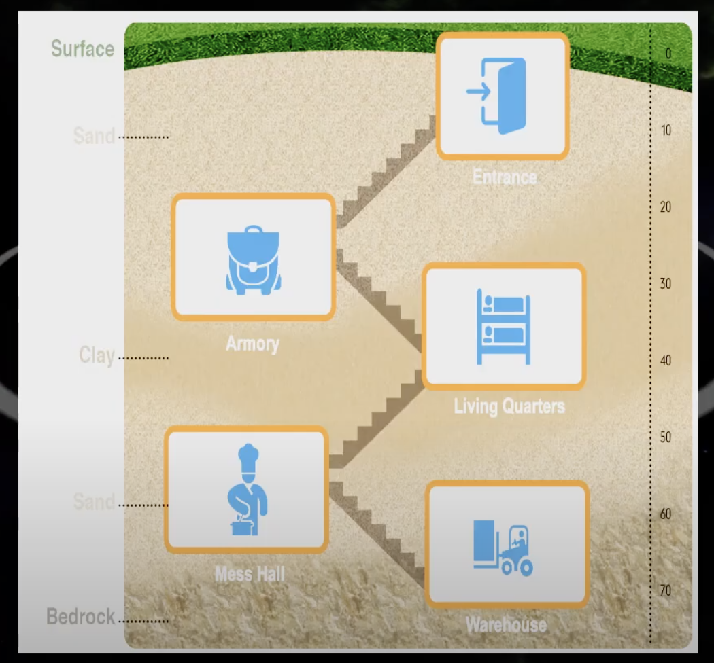

- Some inconsistencies in evidence in  argumentation

<!-- -->

- U4 Arg Details   uses “ Sand is directly above and below the warehouse.” as one piece of evidence collected- this is inaccurate (sand above/ bedrock below)
- It looks like this was different in game (see pic below)… but technically the warehouse is in the water table so this isn’t accurate either. Do we want it to be? I feel like the evidence collected and cited should be technically correct even if it is a red-herring in terms of fitting in the argument?

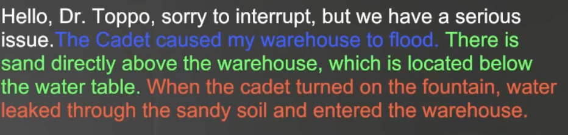

## Argument #1:  Who  flooded the armory?

Claim

I am responsible for the flooding. 

The UMF is responsible for the flooding. 

Evidence 

The armory is 12 to 24 ft. deep, and the water table is 50 ft. deep.  

There is sand directly above and clay directly below the armory.       

Reasoning 

When I turned on the fountain it raised the water table and flooded the armory

The flooding was caused when I activated the fountain. Water moved down through the sand and then was  blocked  by the clay layer causing it to pool around the armory

The UMF built the armory below the water table. Water is seeping into the armory because it is surrounded by water in the soil.

Water from the water table was able to infiltrate up through the space between the soil molecules. This caused the flooding of the armory. 

## Argument #2: Who flooded the warehouse?

Claim

I am responsible for the flooding 

The UMF is responsible for the flooding 

Evidence 

The warehouse and the water table are at the same depth.

Sand is directly above and below the warehouse.

Reasoning 

Water infiltrates through sand easily; therefore, water from the fountain is moving through the sand and into the warehouse.

The water table is a point where the soil below it is saturated and the soil above it is not saturated.

Different soil types allow water to move through at different rates. Water flows through sand that the highest rate.

Water is seeping into the warehouse because the soil around it is filled with water.

## Possible Argumentation Solutions

- Include a bit more narrative explanation for the state of the bunker (holes in ceiling and floor)/ why we’re arguing about this when the holes are the real issue
- Change from bunker rooms to some kind of underground tech that is affected by water

<!-- -->

- Creates issue of evidence collection

<!-- -->

- Cut bunker rooms down to 4 and/or add a glyph or some other fun activity to this section to decrease monotony

<!-- -->

- Filtration/ cleanliness activity
- Concept of soil “holding” water activity

<!-- -->

- Come up with a new argument or argument(s) to replace one or both of these?

## Anderson’s Bunker Notes

- Anderson’s engineering approach is one of “patchwork,” cobbling together whatever she has on hand to make something that just works, but doesn’t necessarily look great. The bunker is created patchwork style out of half-destroyed stuff leftover from the Copernicus. It’s full of holes and opening scaffolding and open access to the subsoil because it works–or at least it did  as long as the ground remained dry.
- Anderson will be trapped in a room at the bottom of the bunker when the flooding occurs. The Player will be contacted by Anderson (with patchy radio interference) letting out a garbled scream after Player activates well in Part 1. 
- When Player reaches surface exterior of bunker, it will look like a tiny,  dilapidated  shack (ramshackle, corrugated metal, rusted, etc.). “It’s a piece of junk!” When Player opens door, it will be directly into a pristine, clean,  futuristic  (small) elevator. The elevator will have a single basic alert play when the character approaches: “Warning, damage detectedin lower levels. Evacuation underway. No mission personnel are permitted to enter.” Anderson breaks in over comms (breaking in and out): “Calm down, ABIE! I’m still down here, it’s fine. It’s just a little bit of flooding, no big deal . ” “How much water has entered the building?” “It’s only gotten up to my neck–I can just stand on a table.” (larger conversation ensures) – ABIE = Automated Base Intelligence Emulator (Anderson tried to make a knockoff DANI that does NOT work well, will be played for fun back-and-forths with DANI)

<!-- -->

- The elevator unceremoniously dumps a full pile of scuba gear from some unseen panel in ceiling to the ground with a clang. “Cadet Anderson, you have indicated the presence of water in the evacuation zone. Please use this emergency air tank to deal with water during your escape. “ Anderson - “I’M NOT ON THE SURFACE, YOU PIECE OF JUNK!”

<!-- -->

- Player drops a drone into the  elevator  (picks up  rescue  gear) and pilots it down through the levels to find out what is going on–in order to fix the problem, in order to rescue Anderson. We’ll play up a “ticking clock” idea (there won’t actually be one) that the water level is rising / air running out to add to the tension of the mission.
- Agreed that the “blame” argument doesn’t work really well here–I would say reframing as just a “what’s causing the flooding?” would be better. Then, Anderson will accept it was her idea to open up the well after the argument is complete.

<!-- -->

- Anderson (as the drone is descending) will want to save her bunker, so she keeps arguing that there’s no way this is permanent, just a temporary thing, that it will go away on its own. Player collects evidence on way down to convince her at end that it was due to the fountain flooding the area, convincing her to put on the rescue air tank and be pulled back up to safety by the drone. So, the scientific argument literally saves Anderson’s life

<!-- -->

- Do there have to be two arguments? I feel like having one climactic  argument  per unit is working out well and is easier for the Player to understand (don’t need as much exposition to explain that there are two concurrent arguments)

## Anderson Bunker Scenario Brainstorm

- After the player digs the well and turns on the fountains Anderson informs them that she just successfully teleported the bunker underground (well mostly- the floors and ceilings are missing but she’s unconcerned)
- She’s extremely proud of her work- but there’s one problem- the warehouse on the bottom floor is partially flooded and filling up fast.  Luckily  she had an small oxygen tank on her and is  using that as she continues her work on that level (or is in a safe room)  
- Her scans show that one of the fountains above the bunker is leaking. She asks the player to turn it off so that the flooding will go away- she’s stubbornly convinced it will  dissipate  quickly once the leak is fixed and she’ll have plenty of oxygen to continue working on that level. 
- After the player turns off the fountain, Toppo (who’s been informed of the situation and is  worried about her safety ) suggests they collect evidence from the bunker to make sure that turning it off will actually dissipate the flooding and that Anderson will have enough oxygen/ is safe to continue working. Player collects evidence via drone.

<!-- -->

- Floor 3:  Scan floor and Ceiling.  Discover a small amount of water slowly dripping from ceiling. Some has pooled on the floor. DANI says it appears the drip rate is slowing. 
- Floor 2:  Scan floor and Ceiling. This area is dry.
- Floor 1: Scan floor and Ceiling. Area is almost completely flooded with more water leaking in rapidly. 

<!-- -->

- After evidence collection, Anderson asks if the player turned the fountain off/ reiterates her confidence that she can keep working because the flooding will go away soon- Toppo requests argument to be sure. 
- Upon analyzing evidence player discovers that Anderson is still in danger because the warehouse is located in the water table and bedrock below will prevent water from filtering out of the area.
- Player saves Anderson from running out of oxygen (or from safe room). 

## Anderson Bunker Scenario Brainstorm

- After the player digs the well and turns on the fountains Anderson informs them that she just found an interesting 
- She’s extremely proud of her work- but there’s one problem- the warehouse on the bottom floor is partially flooded and filling up fast. Luckily she had an small oxygen tank on her and is using that as she continues her work on that level (or is in a safe room) 
- Her scans show that one of the fountains above the bunker is leaking. She asks the player to turn it off so that the flooding will go away- she’s stubbornly convinced it will dissipate quickly once the leak is fixed and she’ll have plenty of oxygen to continue working on that level. 
- After the player turns off the fountain, Toppo (who’s been informed of the situation and is worried about her safety) suggests they collect evidence from the bunker to make sure that turning it off will actually dissipate the flooding and that Anderson will have enough oxygen/ is safe to continue working. Player collects evidence via drone.

<!-- -->

- Floor 3: Scan floor and Ceiling. Discover a small amount of water slowly dripping from ceiling. Some has pooled on the floor. DANI says it appears the drip rate is slowing. 
- Floor 2: Scan floor and Ceiling. This area is dry.
- Floor 1: Scan floor and Ceiling. Area is almost completely flooded with more water leaking in rapidly. 

<!-- -->

- After evidence collection, Anderson asks if the player turned the fountain off/ reiterates her confidence that she can keep working because the flooding will go away soon- Toppo requests argument to be sure. 
- Upon analyzing evidence player discovers that Anderson is still in danger because the warehouse is located in the water table and bedrock below will prevent water from filtering out of the area.
- Player saves Anderson from running out of oxygen (or from safe room). 

## Alternate Argument Idea

Claim

The flooding will resolve on its own after the fountain is turned off.

The flooding will NOT resolve on its own after the fountain is turned off.

Evidence 

There is sand above the warehouse.

There is bedrock below the warehouse 

Reasoning 

Water infiltrates through sand easily; therefore, water from the fountain was moving through the  soil  quickly and into the warehouse.

Since there is bedrock below the warehouse water will continue to pool around the warehouse even if the fountain is turned off. Water is seeping into the warehouse because the surrounding soil is filled with water and water cannot infiltrate through the bedrock

Water from the warehouse will filter down through the bedrock layer, leaving the warehouse dry. 

Water from the water table will be able to infiltrate up through the space between the soil molecules into the sandy layer above the warehouse. 

Sand

Sand

Clay

Bedrock

Fountain

Dining Hall

Living Quarters

Anderson

Warehouse

## Anderson Bunker Scenario Brainstorm

- Unit begins with Anderson telling player about 2 cool alien ruins she’s found. Asks player to fix drill while she sets up in the second set of ruins. 
- After player turns on the fountain they get a call from Anderson about flooding/water leaking into the top (or bottom) floor of ruin #2 
- 

## Alternate Argument Idea (Take 2)

Claim

The  flooding will resolve on its own after the fountain is turned off.

The flooding will NOT resolve on its own after the fountain is turned off.

Evidence 

There is sand above the warehouse.

There is bedrock below the warehouse 

The warehouse is flooded.

The living quarters are dry. 

Reasoning 

Water infiltrates through sand easily; therefore, water from the fountain was moving through the  soil  quickly and into the warehouse.

Sand

Clay

Bedrock

Fountain

Anderson

Sand

Well

Gravel

## Alternate Argument Idea (Take 2)

Claim

The flooding will resolve on its own after the fountain is turned off.

The flooding will NOT resolve on its own after the fountain is turned off.

Evidence 

There is sand above the warehouse.

There is bedrock below the warehouse 

Reasoning 

Sand

Clay

Bedrock

Fountain

Anderson

Sand

Sand

Sand

Clay

Bedrock

Fountain

Dining Hall

Living Quarters

Anderson

Warehouse

## Final Task

Now that the fountains are restored Anderson wants help creating the pond/water  reservoir  for the base. Player chooses from three options which fountain to flood to create this area. 

## Current Issues

- Lack of narrative explanation for why we’re moving water

<!-- -->

- Anderson says it’s because we need to “move it \[the water\] closer to us” but this is super confusing without context

<!-- -->

- How does flooding a fountain achieve this? 

<!-- -->

- We are flooding the fountain to get water to soak into the ground/ divert water to a well that we are going to flood to make a lake?

<!-- -->

- Where did these extra wells come from? How do they relate? 
- If the goal is to make a lake why are there wells in the middle of them? 

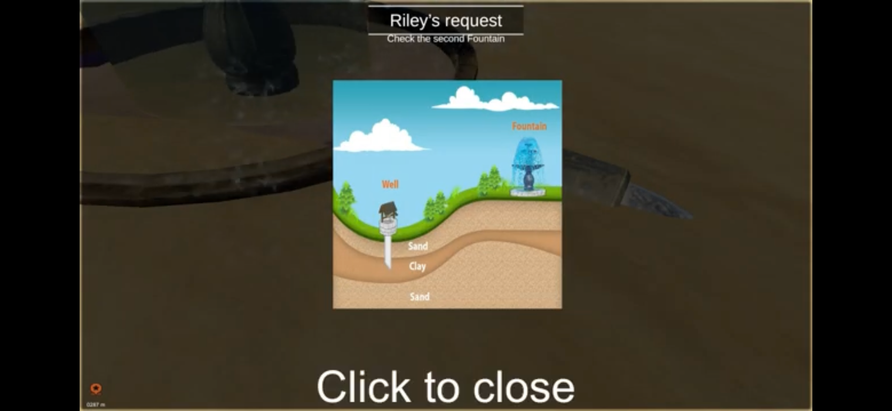

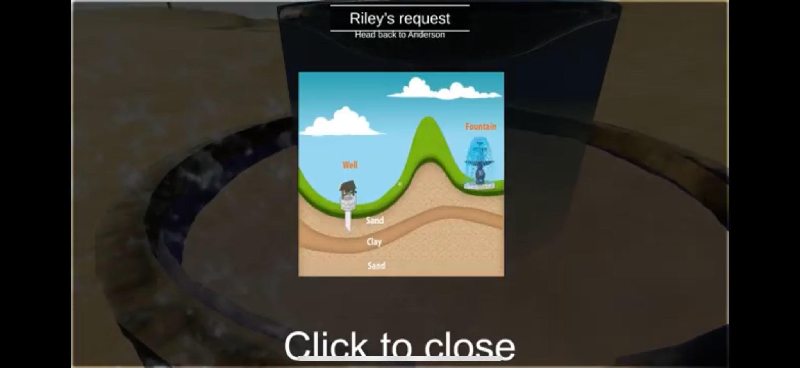

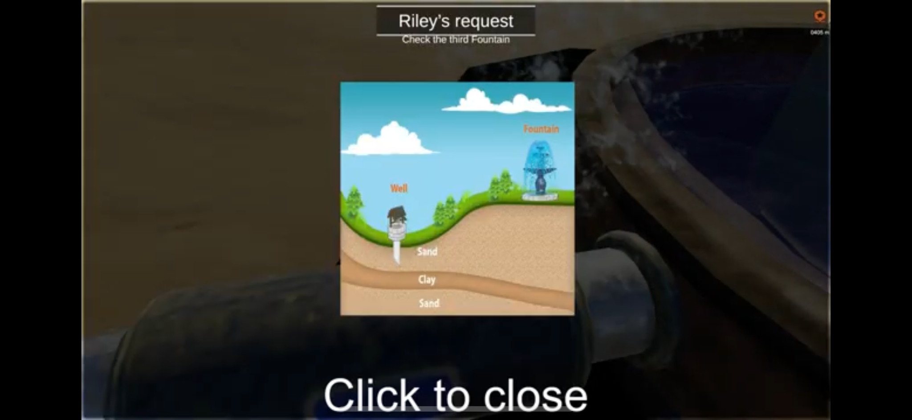

## Final Task Alternate Ideas

Impermeable Surfaces

- Anderson built a large complex of bunkers and training facilities/ covering much of the soil in asphalt. This results in an environmental issue for another area/ affecting another character? Fish in a nearby stream are showing signs of distress. 

<!-- -->

- Task becomes - what caused the issue? 

<!-- -->

- Potential for runoff flow rate after rain, heat of water temp after rain

<!-- -->

- Alternatively: where should we place a large asphalt lot to avoid these issues?

## Slide 31

Habitat Flooding Via Fountains

- After player successfully digs the well. Anderson turns on all the fountains in the area.

<!-- -->

- Unfortunately turning on one of the fountains resulted in flooding of an animal’s habitat ???
- One fountain has a leak (underground) but we don’t know which one and Anderson doesn’t want to spend money to dig and seek out the source of the leak without a good argument
- Task becomes- which fountain caused the flooding? 

<!-- -->

- Alternatively: where should we place a lake to avoid flooding a specific habitat?

## Build an Oasis

Direct water in some way to a specific location?

Habitat disturbed by Anderson building impermeable surfaces of some sort in preventing infiltration and diverting water flow. Maybe there are several options of items to remove to restore wetland area?

There is an existing area nearby (or at camp) with polluted water (not dissolved) identified by Tera. Player must design filter system to clear it and  restore  the oasis. 

- Pollution caused by some character dumping waste product?
- Don’t have a bunch of materials at their disposal because of scenario

Another well site exists but is dried up- you must direct water to it by flooding a fountain?

## Design a  Filtration  System

DIY  Filter:  DIY Pond Filter Made EASY From Trash Can!  

Example Lesson:  https://www.nrcs.usda.gov/sites/default/files/2022-10/filtration_lesson_plan.pdf  

Each player gets 3 attempts to get a run that results in clean water and doesn’t take too long??? Their 3rd attempt “sticks” and affects future interactions with the  area . 

Success

- At least 6 layers
- No more than 2 gravel layers

Fail

- Use bedrock (water doesn’t infiltrate)
- Use clay layer (takes too long & Tera gets frustrated)
- Less than 6 layers (water is dirty) 
- More than 2 gravel layers (water is dirty)

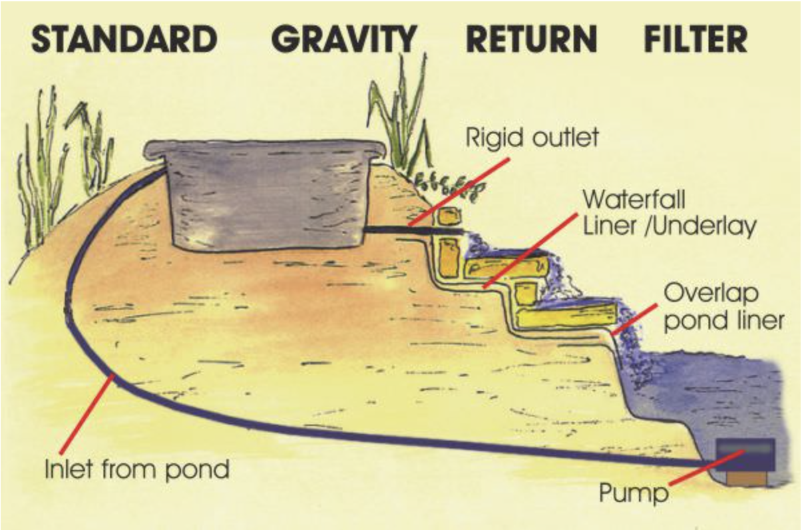

Drag and Drop Options

(Anderson handles this part)

(Player decides which/how many soil layers to place inside top container and in  what  order)

## Activity Ideas

## Infiltration/Cleanliness of Water

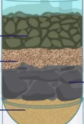

Goal : Fill a container up with clean water within a certain period of time. Maybe it somehow triggers a water powered door or something?

Pipes are movable and player connects them to  reservoir  

0:30

Players can change one layer of soil to a different type?

## Slide 36

Goal :  Fill the tank with clean water within the correct amount of time 

- Fill too fast tank overflows
- Fill too slow run out of time 
- Too dirty =  fail

00: 30

## Infiltration Rate/ Soil Type

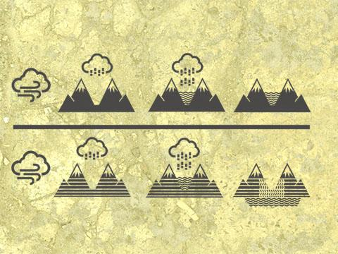

1.0 Glyph for reference (should make more interactive to match other units

(Very Similar to 2.0 U2 Glyph)

Visual indicator of flow rate?

Soil particle view of each of the 4 types of soil

## Final Task Brainstorm

## Soil Type and Holding Capacity

Soil Water Holding Capacity Determination Practical Experiment  

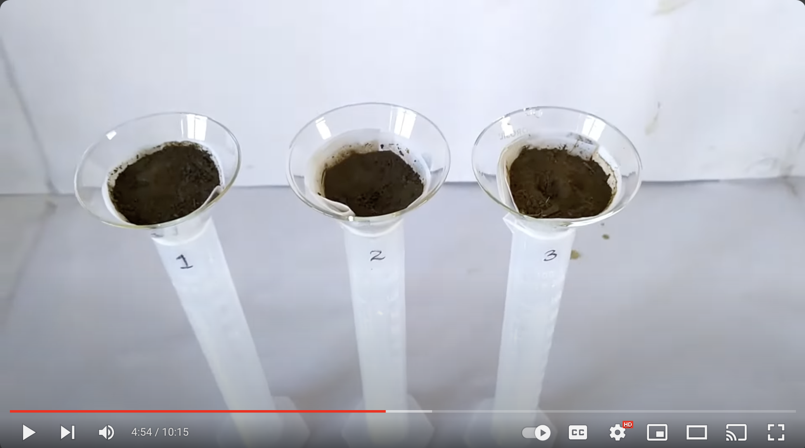

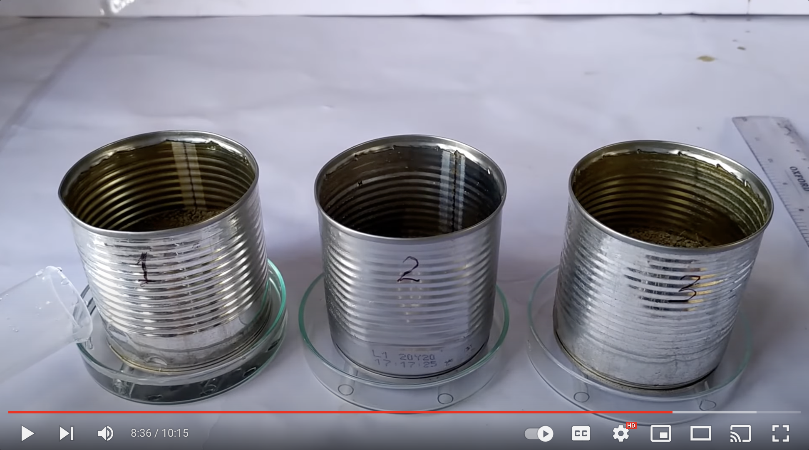

## Tera’s Garden Boxes

- Tera wants to add garden boxes to Anderson’s base to help her out with food (olive branch?)
- Players are given scenarios with 3 types of crops she’d like to plant

<!-- -->

- One that requires lots of water (clay soil)
- One that requires med amounts of water  (sandy soil)

<!-- -->

- If we do decide to do this we may want to switch to a bedrock, clay, loam, sand  arrangement  as I’m not sure much would grow in gravel?

<!-- -->

- One that requires very little water (gravelly soil)

<!-- -->

- Players must successfully choose to match correct soil type to each plant

## Slide 41

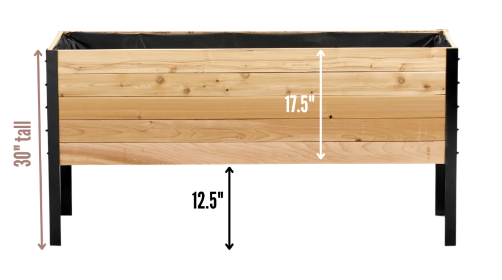

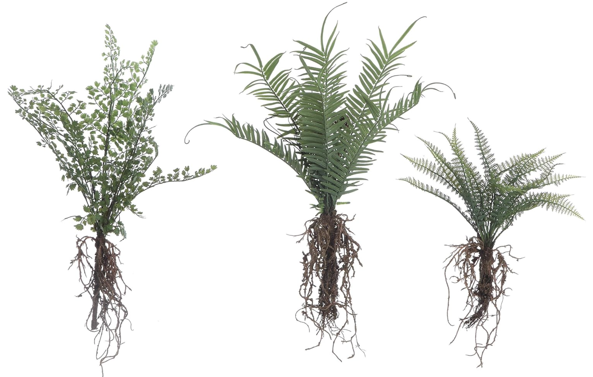

Examine soil to determine which has largest  particle  size

Fill soil containers

Choose plant to suit each soil type

Water plant (and view difference in amount held/ see results)

## Soil Sponges?

- Player has to transport drinking water and must choose soil sponges for the job.

## Can we incorporate holding capacity into the dungeons?

- A door opening mechanism that requires a certain weight of soil or water?

<!-- -->

- Cubes (with drainage holes) need to be heavy enough to press down a pad 

<!-- -->

- Reservoir  underneath soil machine that must be full to a certain amount?

## Adjust Soil Key?

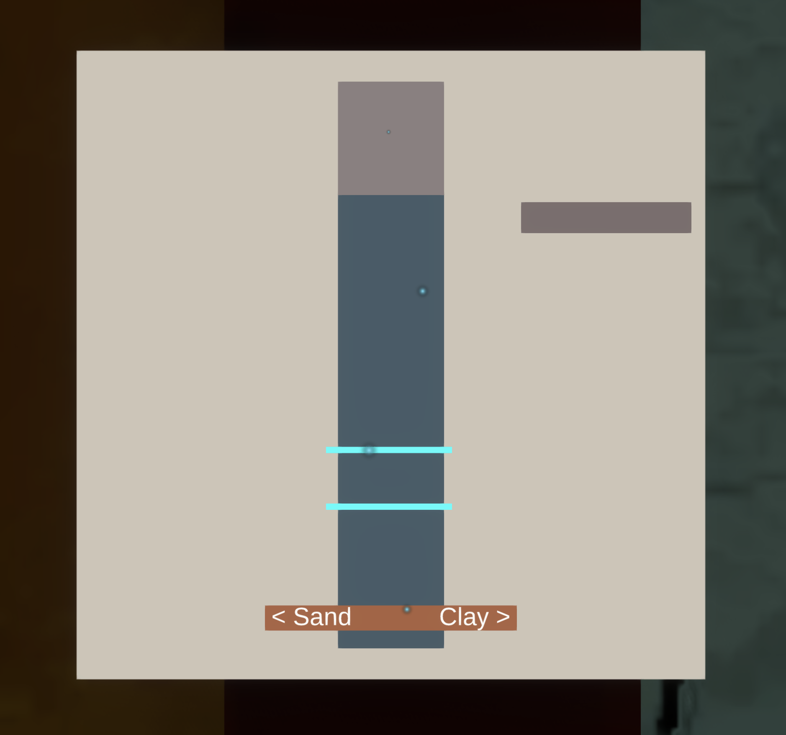

## Visual Demonstration

Water movement in the soil  

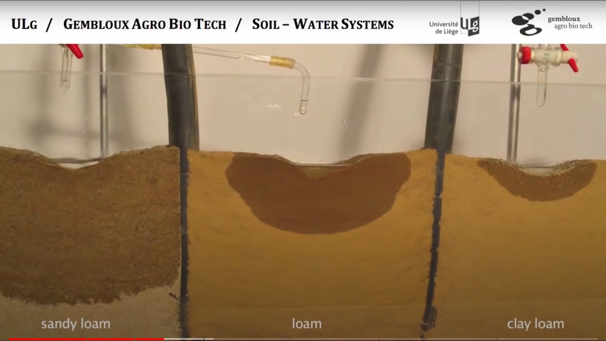

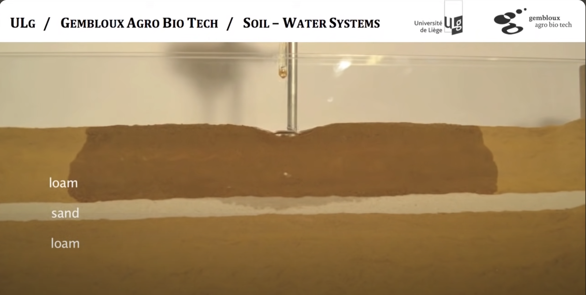

## Slide 46

Soil particle view of each of the 4 types of soil

Soil particle view of each of the 4 types of soil

Particle/ Pore Size

Particle/ Pore Size

Holding Capacity

Infiltration Rate

## Resource Dump

## Slide 48

https://www.youtube.com/watch?v=8mfBomrw0rs  

https://www.youtube.com/watch?v=ego2FkuQwxc  

https://www.youtube.com/watch?v=bG19b06NG_w  

https://www.teachengineering.org/activities/view/cub_environ_lesson06_activity2  

Water Quantity: storm drains deliver large volumes of water to streams much faster than would occur naturally, resulting in flooding and bank erosion. Stream inhabitants are stressed, displaced, or killed by the fast moving water and the debris and sediment it brings with it.

Water Quality: pollutants (gasoline, oil, fertilizers, etc) accumulate on impervious surfaces and are washed into the streams.

Water Temperature: during warm weather, rain that falls on impervious surfaces becomes superheated and can stress or kill stream inhabitants.

https://dnr.maryland.gov/streams/Pages/streamhealth/How-Impervious-Surface-Impacts-Stream-Health.aspx  

## Slide 49

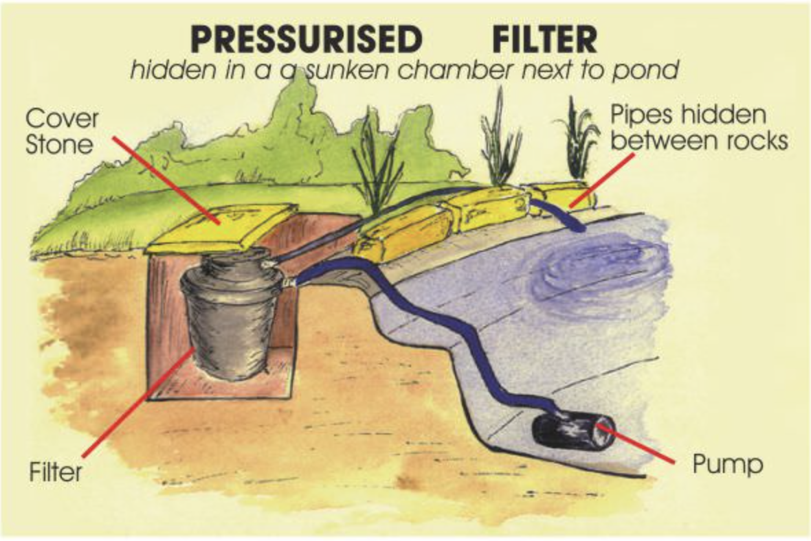

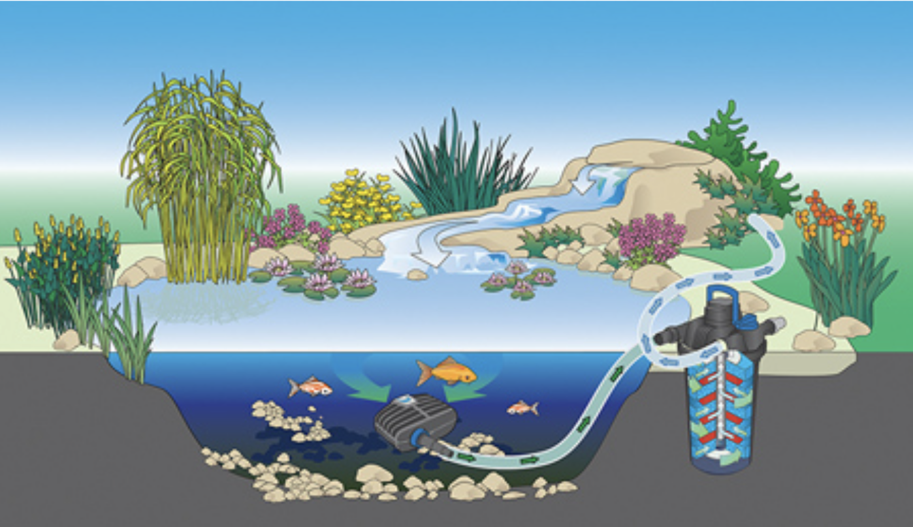

https://www.youtube.com/watch?v=zvoOCq3gcTc

https://www.youtube.com/watch?v=zvoOCq3gcTc  

## Slide 50

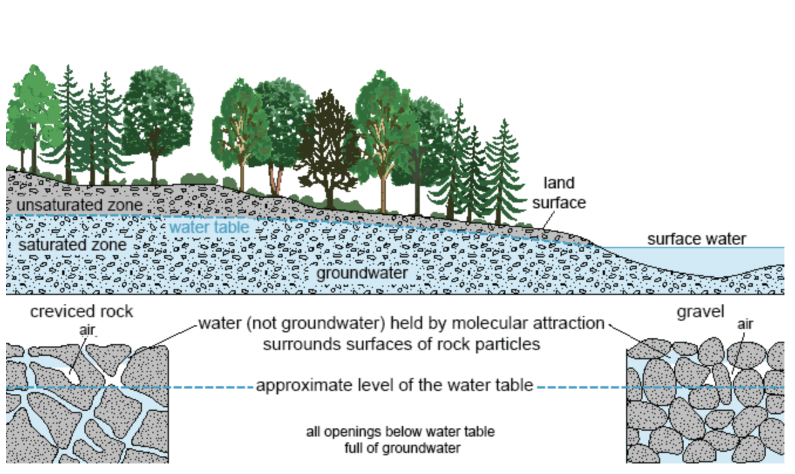

W4.1 Predict the location of the water table based on the saturated (region below the water table where all open spaces are filled with water) and unsaturated zones (region immediately below the land surface that contains air and water).

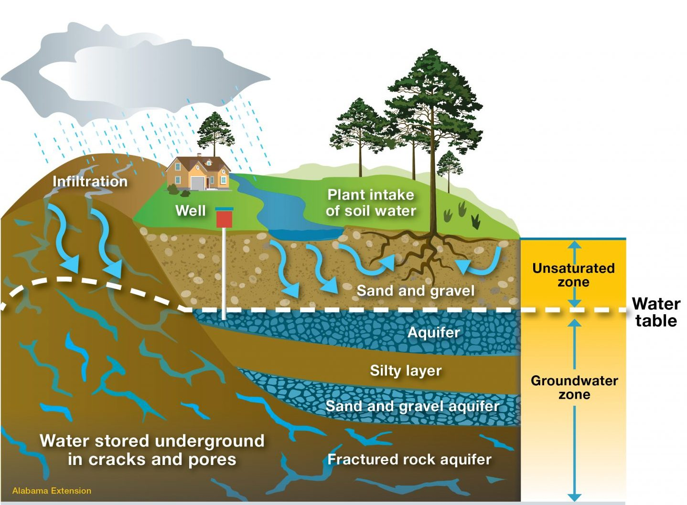

## Unit 3 Scenario #2

Same as #1 except Tera presents the player with four species of fish:  A, B, C, D, and E

She asks the player to sort them into two groups based on the research she’s done so far.

Species A and B must be together because B cleans parasites and dead skin off of A.

Species C is aggressive towards Species A so they cannot be in the same group.

Species E’s cannot have the same food as Species B so they need to be separate.

Species A and D share the same food so they should be in the same group.

Solution

Group 1: Species A, B, D

Group 2: Species C, E

\*Not curricularly related but works with current layout/ more dev intensive

## Unit 3 Activity (Continued)

- Placement of fish (top or bottom area on map) doesn’t matter as long as they are grouped correctly

Results:

- If species A is not with B neither survive
- If species A is with C, A doesn’t survive
- If species E is with B, E doesn’t survive

## Slide 53

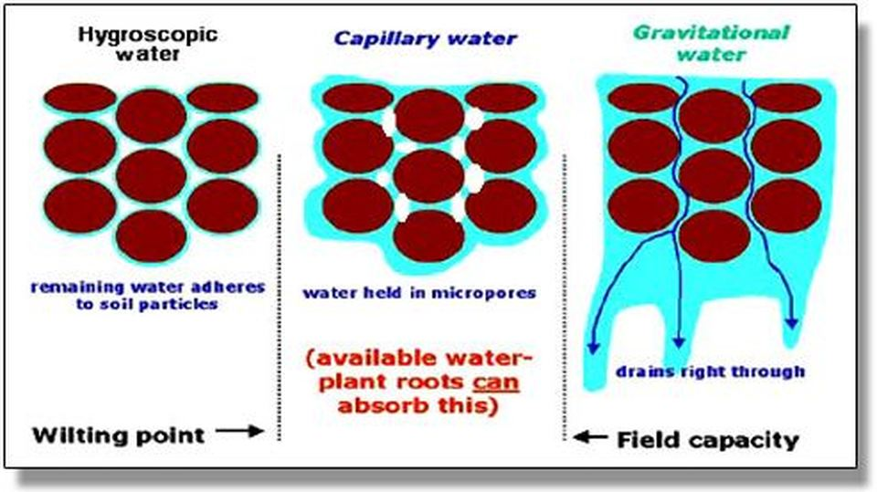

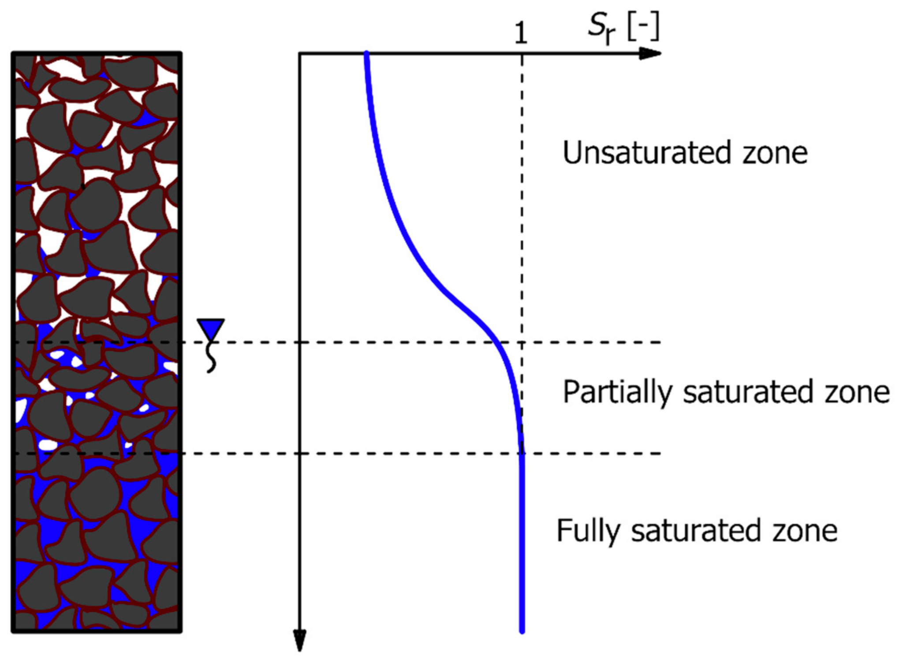

## Slide 54

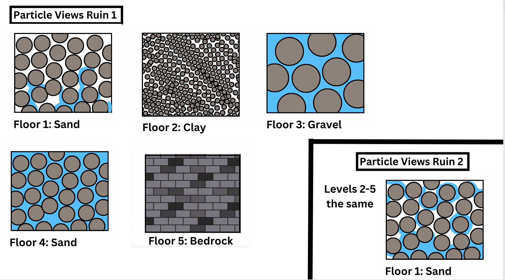
