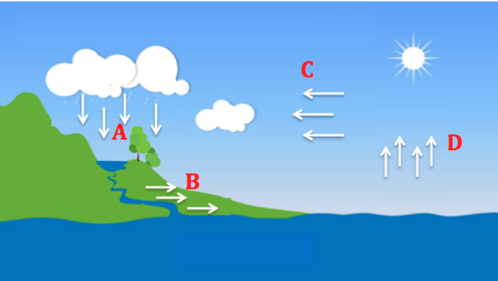
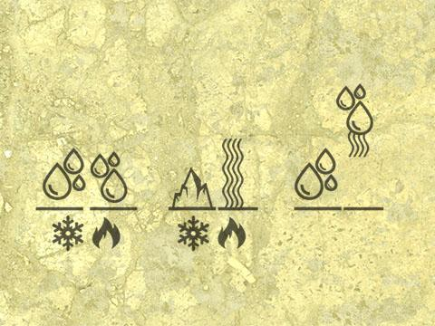
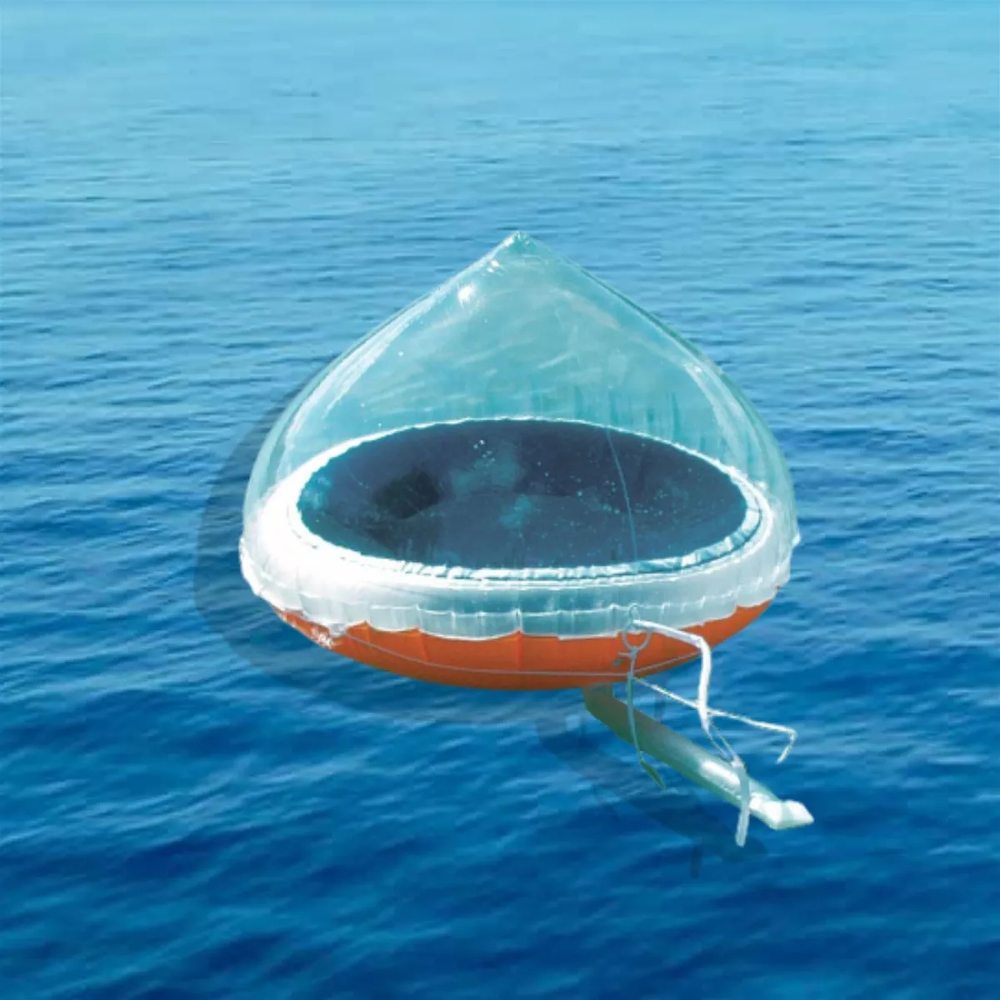
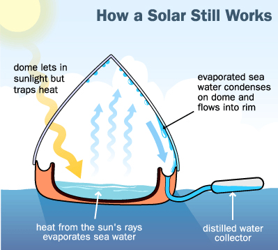
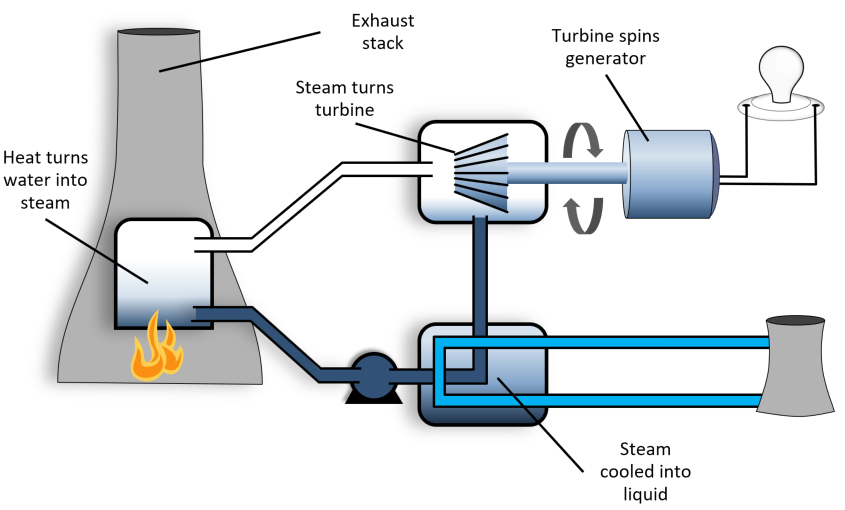
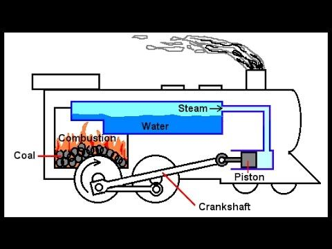
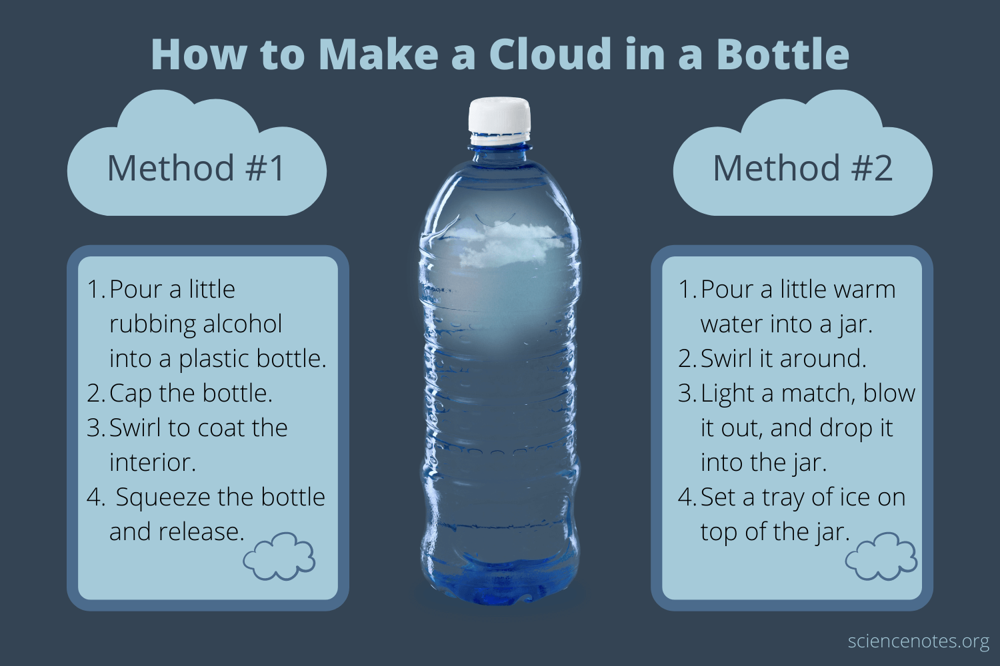

## U5 Summary/Suggestions

## Overview 1.0

- Player follows Bill to LargeMart Island
- They explore an alien seaside facility
- Bill shows off his salt making process
- Bill and the player get locked in the cave
- Bill is concerned  they’ll run out of water
- Player builds their own distillery 
- Player creates argument to convince Bill that his salt making device can be used to collect water because the water did not disappear when heated it just changed forms
- Player collects evaporated water and condenses it so they have drinking water
- They escape? Head back to LargeMart
- Bill wants to make his own distillery to sell salt and water off planet and the player helps

## Learning Objectives 

Water Science Objective:

W5.1  Explain the movement of water between surface and atmospheric systems

Argumentation Objective:

 

  A5.1  Provide a counter argument to a faulty claim that is provided. 

## Assessment Questions (By Topic)

4. Which of the following is a major source of moisture that reaches or becomes part of the Earth's atmosphere?

- Lakes  
- Rivers   
- Oceans  
- Polar ice caps   

6. From where does most of the Earth's water evaporate?

- Lakes  
- The ocean  
- Trees  

8. Where does the energy that powers the water cycle come from?

- The ocean  
- Thunderstorms  
- The sun  

## Slide 5

19. In the picture above, which group of arrows represents an instance of evaporation?

Group A  

Group B  

Group C  

Group D    

20. Under which conditions in the picture above would you expect the rate of evaporation to be the greatest?

15ºF night at midnight  

30ºF night at midnight  

70ºF at noon 

45ºF at noon  

## Slide 6

5. When the temperature of water and the atmosphere becomes colder, the rate of evaporation:

Decreases 

Increases 

Stays the same  

21. Which is an example of evaporation?

Water vapor becomes liquid water on the side of a glass  

Water vapor moves from inside a cell wall to the atmosphere  

Liquid water moves through soil particles  

Liquid water heats up and turns into water vapor  

22.  What is evaporation?

The process by which particles leave a gas and become a liquid   

The process by which a solid changes directly into a gas   

The process by which particles leave a liquid and become a gas  

The process by which a liquid changes into a solid  

## Argumentation

## Suggestions

- Incorporate the idea that the ocean is a huge source of evaporation
- Incorporate the idea of the sun as energy for water cycle
- Better demonstrate the effect of temperature on evaporation rate (glyph)
- Increased emphasis on the behavior of particles in each state/ during change of state

## Old Glyph

## Old Toppo Poster

## Brainstorm

- Solar Still

<!-- -->

- Bring activity out of cave/facility and on to ocean?
- Ties in relationship of energy from sun + ocean as a source of evaporation

<!-- -->

- Steam turbine or engine???
- Temperature Change 

<!-- -->

- Ability to manipulate temperature in the dungeon

<!-- -->

- Instead of pressing panel for evaporation etc. change temp?

